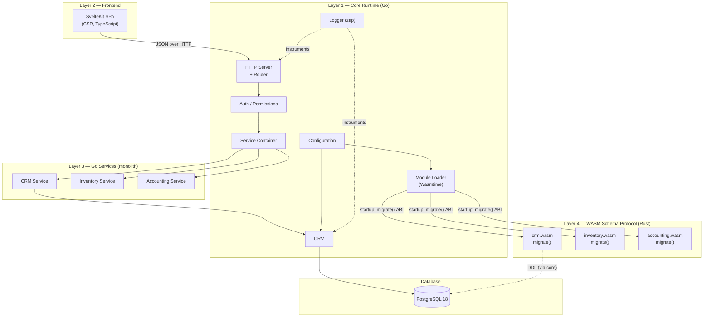
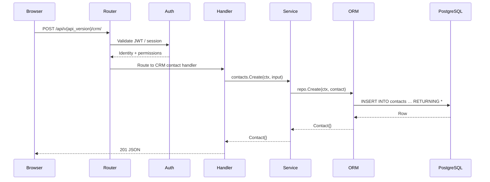
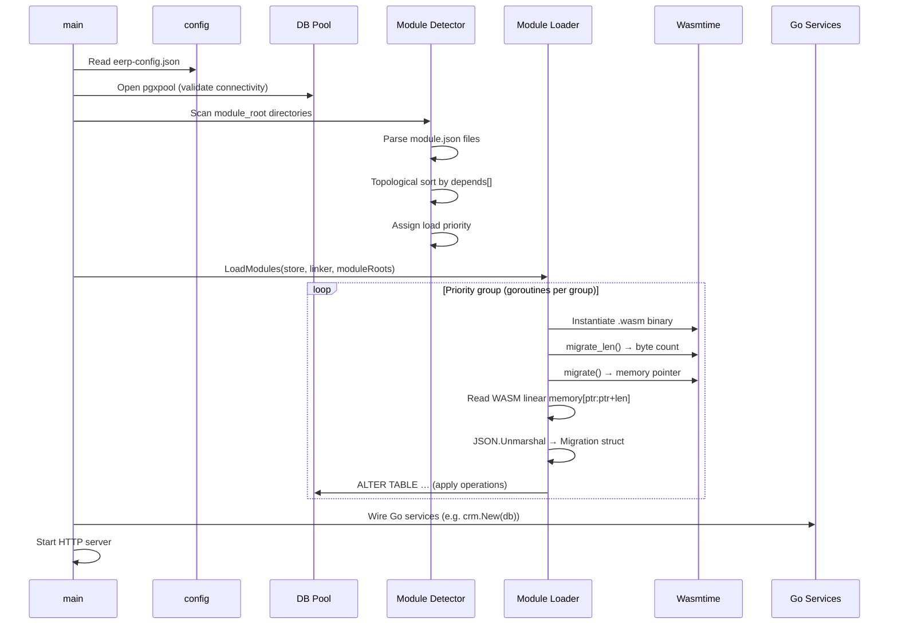
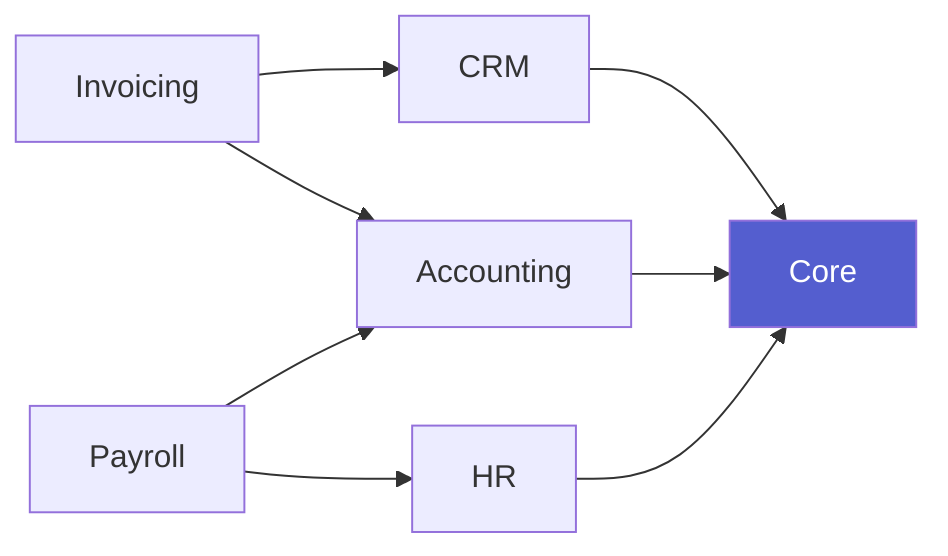
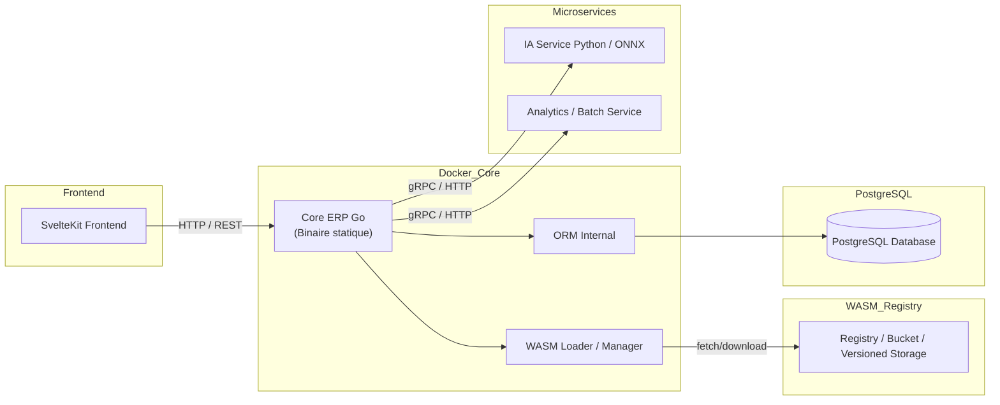
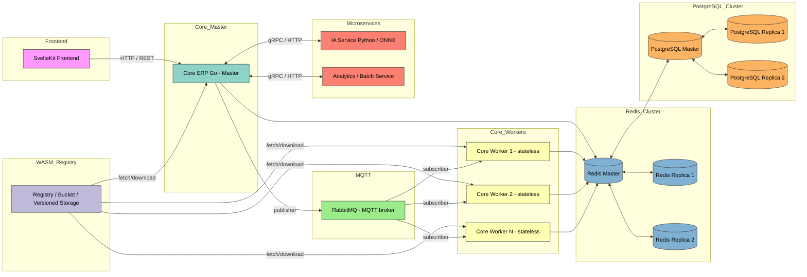

# Architecture Overview

EERP is built as a **pluggable runtime for ERP business logic**. The core handles infrastructure concerns (database, module loading, HTTP, configuration); business domains live inside a two-part module system: a WASM binary for schema declaration and a Go service for business logic.

---

## The Hybrid Module Model

EERP modules have two components with different responsibilities:

| Component | Language | When it runs | What it does |
|---|---|---|---|
| WASM binary | Rust (or any WASM-capable language) | Startup only | Declares the module's DB schema via `migrate()` ABI |
| Go service | Go (compiled into the monolith) | Every request | Implements business logic, exposes HTTP handlers |

This split gives sandboxed schema ownership without the IPC cost of routing every request through WASM.

> **Current state**: Go services are the active path for business logic (see `core/modules/crm/`). The WASM loader is implemented and runs at startup; Rust-compiled `.wasm` binaries are the roadmap for full schema decoupling.

---

## The Four Layers

Each layer has a strict contract with the one below it. Modules never talk to each other directly — all inter-module communication flows through the core.

---

## Why This Architecture

### Schema ownership without IPC

Classic ERP systems suffer from tight coupling between business logic and framework code. EERP inverts this: each module owns its database schema via the WASM `migrate()` ABI (sandboxed, language-agnostic), while business logic runs as a compiled Go service with direct ORM access and no serialization overhead per request.

The WASM boundary is intentionally narrow: it is only crossed once per module per startup, not on every HTTP request.

### Schema ownership per module

Each module owns its database schema. When the core starts, the WASM loader calls `migrate()` on each module's binary, reads the returned JSON from WASM linear memory, and applies the DDL operations. This means:

- A module can be deployed to any EERP instance without manual schema setup.
- Modules evolve their schemas independently via version-gated migrations.
- The core never contains domain-specific table definitions.

### Type safety without reflection overhead

The ORM uses Go generics and compile-time struct inspection to build all metadata once at startup. Every subsequent query operates on pre-computed field maps with zero reflection. This is critical for ERP workloads where a single request can trigger dozens of queries.

---

## Layer Responsibilities

### Core Runtime (Go)

| Component | Responsibility |
|---|---|
| `cmd/app/main.go` | Bootstrap: DB pool, Wasmtime engine, WASM module loading, Go service wiring |
| `orm/` | Type-safe database access via generics |
| `internal/module/detector.go` | Filesystem scan, `module.json` parsing, dependency resolution, priority assignment |
| `internal/module/load.go` | Wasmtime instantiation, `migrate()` call, DDL execution |
| `internal/module/migration.go` | `applyMigration` — version-gated DDL via pgx |
| `internal/types/` | Shared data contracts (Config, Module, Migration, Operation) |
| `internal/common/` | Logger (zap), JSON utilities, dependency graph |

The core is deliberately minimal. It provides infrastructure; it contains no business logic.

### WASM Modules (Schema Protocol)

Each module's WASM binary:

1. Declares its identity and dependencies in `module.json`
2. Exports `migrate() → *u8` and `migrate_len() → usize` — the schema ABI
3. Returns a Migration JSON describing the tables and columns it needs

The binary is sandboxed by Wasmtime: a panic or infinite loop cannot crash the Go process.

### Go Services (Business Logic)

Each module's Go service:

1. Defines entity structs (embedding `model.BaseModel`)
2. Instantiates a typed `orm.Repository[T]` for each entity
3. Implements business operations using the ORM's query builder and transaction API
4. Will register HTTP handlers with the router once the handler dispatch layer is implemented

### Frontend (SvelteKit)

The frontend is a pure CSR SPA that communicates with the backend exclusively over HTTP/JSON. It has no knowledge of module internals — it only calls routes exposed by the core's HTTP server.

The decision to avoid SSR is deliberate: EERP deployments may serve the frontend from a CDN entirely separate from the Go backend. See [ADR-004](../adrs/004-csr-frontend.md).

---

## Data Flow: A Typical Request

---

## Startup Sequence

The WASM phase (schema) and the Go service wiring are sequential but separate. A module can run as a pure Go service even before its WASM binary exists — the loader skips the migrate step if no `.wasm` is found.

---

## Module Dependency Graph

Modules declare dependencies in `module.json` via the `depends` array. The detector performs a topological sort and assigns a numeric priority. Modules at the same priority level load concurrently; different priority levels are sequential. This guarantees that a module's dependencies are always loaded before it.

In this example, `Core` (priority 0) loads first, `CRM`, `Accounting`, and `HR` load concurrently at priority 1, then `Invoicing` and `Payroll` load concurrently at priority 2.

---

## Key Design Constraints

1. **Modules never import core packages.** The contract is the WASM ABI and the HTTP API, not Go types.
2. **The ORM never interpolates values.** All user-supplied data is passed as parameters (`$1`, `$2`, …). SQL injection is structurally impossible.
3. **Soft delete is the default.** Hard delete is explicit and audited. ERP systems require audit trails.
4. **Configuration is a single JSON file.** No environment variable soup, no multi-file inheritance. One file, one source of truth.
5. **The core has no business logic.** If you find yourself adding domain-specific code to the core, it belongs in a module.

---

## Goal

The main objective is to finish the project with the following architecture.

### First version (V1.0.0)

This first version is a MVP, it includes only the main elements of the ERP in order to develop on to custom it as much as possible. On this architecture, both relations between modules/plugins and external services are included but the system isn't yet design to scale. The caching, scaling and architecture improvements are dedicated to the second version of the ERP as readable on the second diagram under.

### Second version (V2.0.0)

This version of the architecture is mainly turned around the high capacity and scaling. The first version should act as an entire worker and accept any connexion. The second version accept a master comportement that get connected to the mqtt and stay the backend entrypoint. Its comportement looks more like an API gateway but accepts workload to reduce useless server creation. 