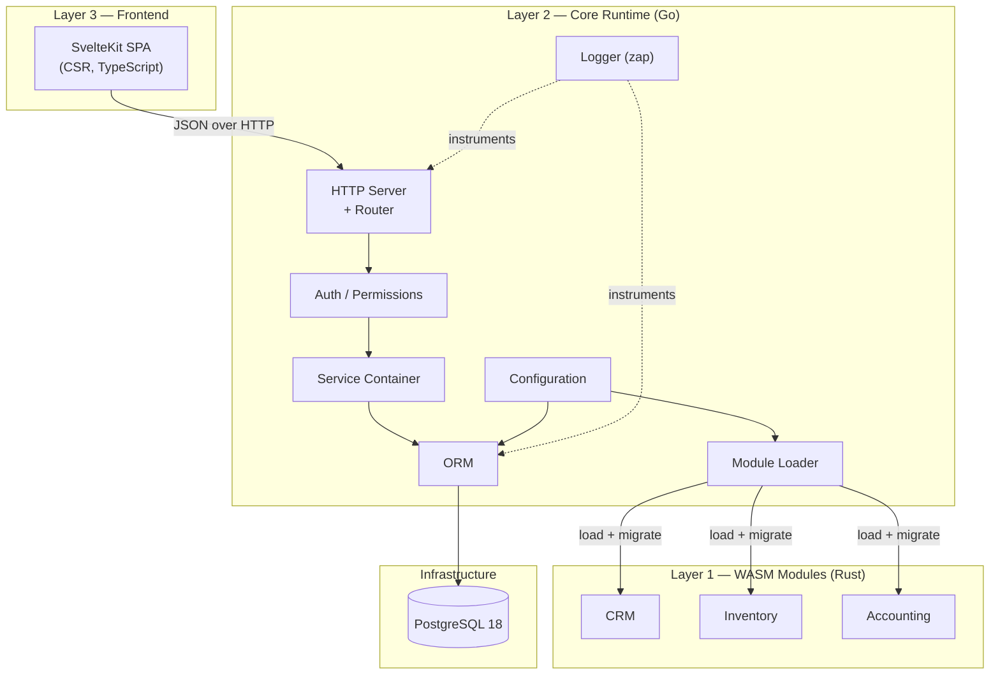
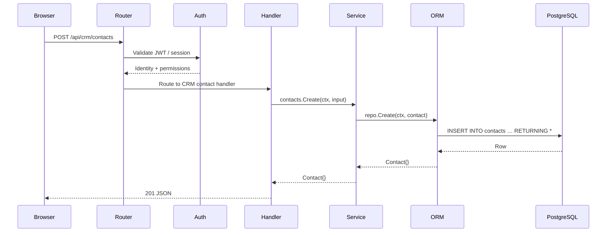
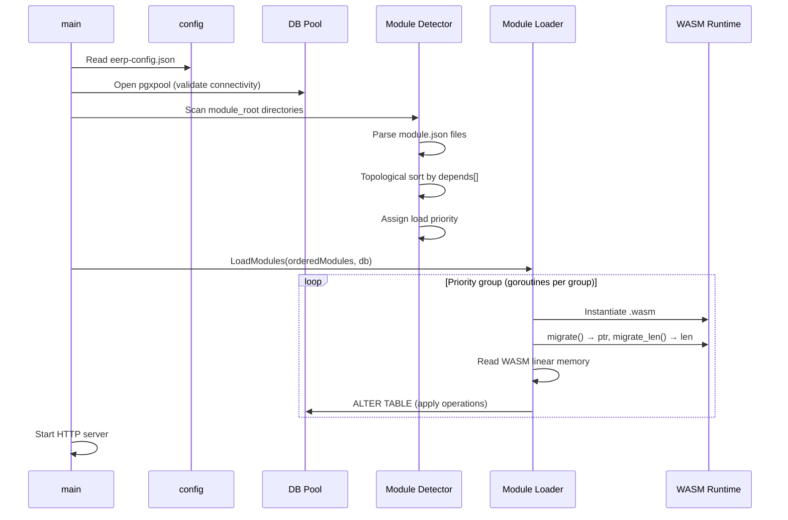
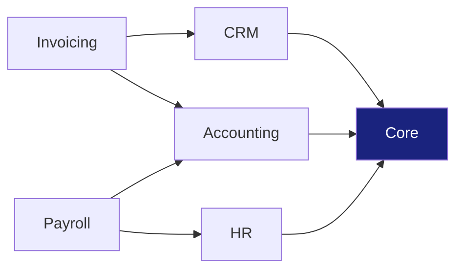

# Architecture Overview

EERP is built as a **pluggable runtime for ERP business logic**. The core handles infrastructure concerns (database, module loading, HTTP, configuration); business domains live entirely inside WASM modules.

---

## The Three Layers

Each layer has a strict contract with the one below it, and modules never talk to each other directly — all inter-module communication flows through the core.

---

## Why This Architecture

### Separation of core and domain

Classic ERP systems suffer from tight coupling between the business logic and the framework. Adding a new module means touching the core. EERP inverts this: the core is immutable; modules are the extension point.

The mechanism for this inversion is WASM. A module is a compiled binary with a defined ABI. The core instantiates it, calls its exported functions (e.g., `migrate()`), and provides it with a Go-side service API. The module never links against the core at compile time.

### Schema ownership per module

Each module owns its database schema. When a module loads, it returns a `Migration` struct describing the tables and columns it needs. The core applies those changes. This means:

- A module can be deployed to any EERP instance without manual schema setup.
- Modules evolve their schemas independently.
- The core never contains domain-specific table definitions.

### Type safety without reflection overhead

The ORM uses Go generics and compile-time struct inspection to build all metadata once at startup. Every subsequent query operates on pre-computed field maps with zero reflection. This is critical for ERP workloads where a single request can trigger dozens of queries.

---

## Layer Responsibilities

### Core Runtime (Go)

| Component | Responsibility |
|---|---|
| `cmd/app/main.go` | Bootstrap sequence, wiring |
| `orm/` | Type-safe database access |
| `internal/module/` | WASM discovery, loading, migration |
| `internal/types/` | Shared data contracts |
| `internal/common/` | Logger, JSON utilities, dependency resolution |

The core is deliberately minimal. It provides infrastructure; it contains no business logic.

### WASM Modules (Rust)

Each module is a self-contained Rust crate that:

1. Declares its identity and dependencies in `module.json`
2. Exports `migrate()` and `migrate_len()` to declare its schema
3. Implements its business logic against the core's service API

Modules are sandboxed: a panic in a module cannot crash the core.

### Frontend (SvelteKit)

The frontend is a pure CSR SPA. It communicates with the backend exclusively over HTTP/JSON. It has no knowledge of module internals — it only calls routes exposed by the core's HTTP server.

The decision to avoid SSR is deliberate: EERP deployments may serve the frontend from a CDN entirely separate from the Go backend. See [ADR-004](../adrs/004-csr-frontend.md).

---

## Data Flow: A Typical Request

---

## Startup Sequence

---

## Module Dependency Graph

Modules declare dependencies in `module.json` via the `depends` array. The detector performs a topological sort and assigns a numeric priority. Modules at the same priority level load concurrently; different priority levels are sequential. This guarantees that a module's dependencies are always loaded before it.

In this example, `Core` (priority 0) loads first, `CRM`, `Accounting`, and `HR` load concurrently at priority 1, then `Invoicing` and `Payroll` load concurrently at priority 2.

---

## Key Design Constraints

1. **Modules never import core packages.** The contract is the WASM ABI and the HTTP API, not Go types.
2. **The ORM never interpolates values.** All user-supplied data is passed as parameters (`$1`, `$2`, …). SQL injection is structurally impossible.
3. **Soft delete is the default.** Hard delete is explicit and audited. ERP systems require audit trails.
4. **Configuration is a single JSON file.** No environment variable soup, no multi-file inheritance. One file, one source of truth.
5. **The core has no business logic.** If you find yourself adding domain-specific code to the core, it belongs in a module.
