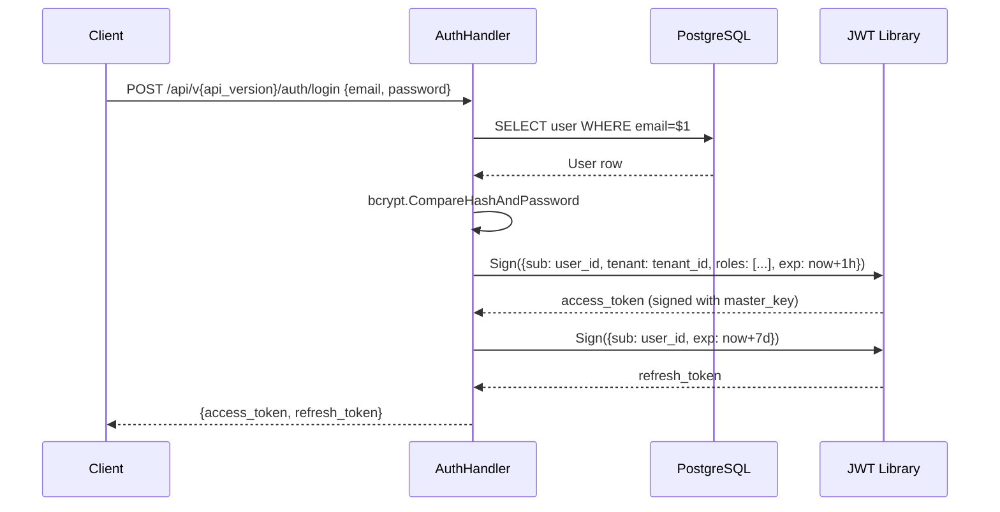
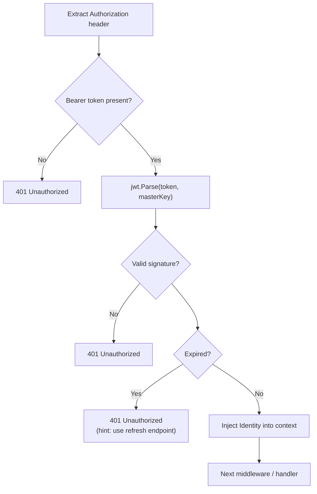
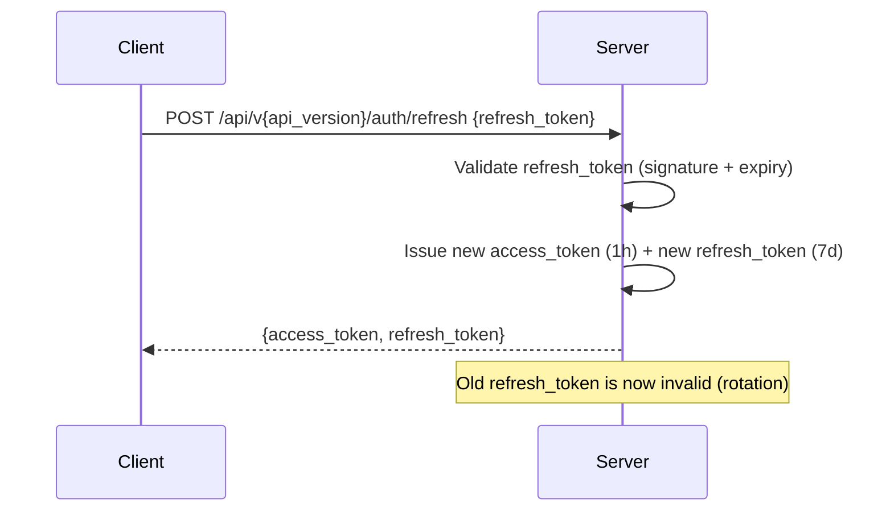
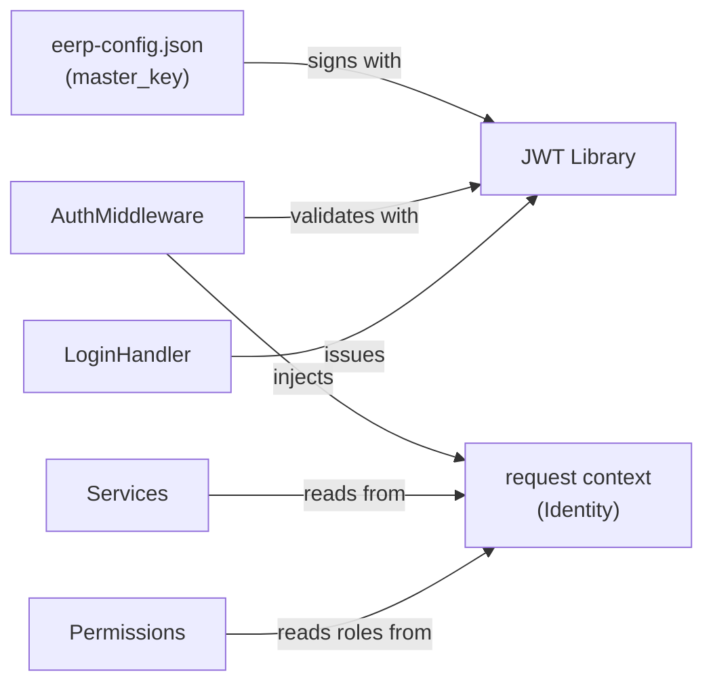

# Authentication

!!! note "Implementation status"
    Authentication is a planned component. The `master_key` field in the configuration is the foundation; the JWT issuance and validation logic is not yet implemented. This page documents the intended design.

---

## Purpose

Authentication answers the question: **who is making this request?** Every non-public endpoint must establish an identity before allowing the request to proceed.

---

## Responsibilities

- Issue signed tokens on successful login
- Validate tokens on every protected request
- Inject the authenticated identity into the request context
- Refresh tokens before they expire
- Invalidate tokens on logout

---

## Intended Design: JWT with `master_key`

EERP uses stateless JWT authentication. The `master_key` from `eerp-config.json` is the HMAC signing key. No external identity provider is required for basic deployments.



### Token Payload

```json
{
    "sub": "01J...",
    "tenant": "01J...",
    "roles": ["admin", "crm:write"],
    "iat": 1705312200,
    "exp": 1705315800
}
```

| Claim | Description |
|---|---|
| `sub` | User ID (UUID) |
| `tenant` | Tenant/organisation ID |
| `roles` | Effective roles for permission checks |
| `iat` | Issued at |
| `exp` | Expiry (access: 1h, refresh: 7d) |

---

## Validation Middleware

On every protected request:



---

## Identity in Context

Downstream handlers and services retrieve the identity from context:

```go
type Identity struct {
    UserID   uuid.UUID
    TenantID uuid.UUID
    Roles    []string
}

func IdentityFromContext(ctx context.Context) (Identity, bool) {
    id, ok := ctx.Value(identityKey{}).(Identity)
    return id, ok
}
```

Services use `IdentityFromContext` when they need to filter by tenant or check roles:

```go
func (s *Service) ListContacts(ctx context.Context) ([]Contact, error) {
    identity, _ := auth.IdentityFromContext(ctx)
    return s.contacts.Query().
        Where(orm.Cond("tenant_id = $1", identity.TenantID)).
        All(ctx, s.db)
}
```

---

## Multi-Tenancy

Every entity that belongs to a tenant has a `tenant_id` column. The authentication middleware injects the tenant ID from the token; services filter by it. The ORM provides no automatic tenant filter — services are responsible for applying the `WHERE tenant_id = $1` condition.

---

## Token Rotation



Refresh tokens are single-use. Presenting a used refresh token invalidates the entire session (theft detection).

---

## Interactions



---

## Extension Points

| Extension | How |
|---|---|
| External IdP (OAuth2/OIDC) | Replace `LoginHandler` with OIDC callback; map claims to `Identity` |
| Session-based auth | Replace JWT with server-side session store; keep the `Identity` context contract |
| API keys | Issue long-lived tokens with restricted roles; validate via same middleware |
| MFA | Add a second factor check between password validation and token issuance |
