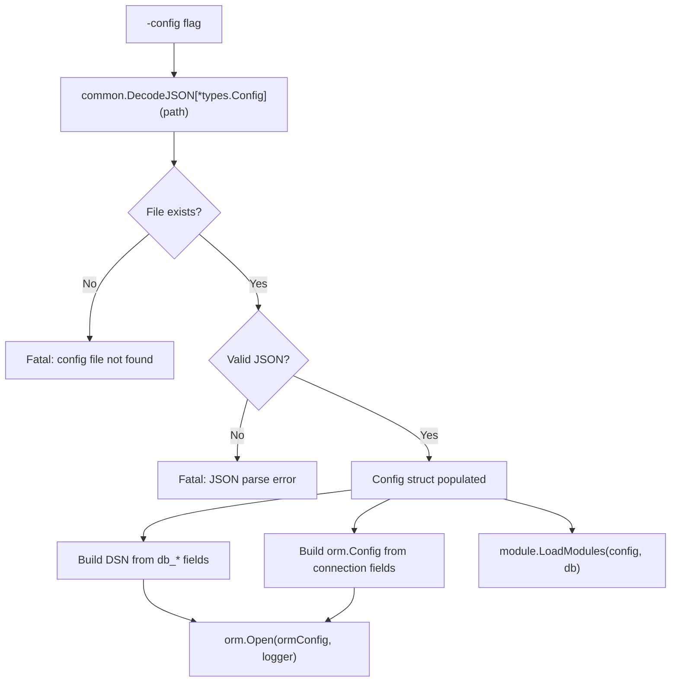
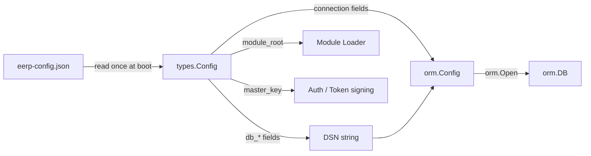

# Configuration

EERP uses a single JSON file as its sole configuration source. There is no environment variable inheritance, no multi-file override chains, and no runtime mutation of configuration.

---

## Purpose

Configuration complexity is a common source of deployment bugs. A value set in an environment variable overrides a file, which overrides a default, and the effective configuration becomes hard to reason about. EERP's approach: one file, one source of truth, validated at startup.

---

## Configuration File

The file path is passed via the `-config` CLI flag:

```bash
go run ./cmd/app/... -config="../../eerp-config.json"
```

### Full Reference

```json
{
    "module_root": ["/absolute/path/to/modules"],
    "master_key": "change-me-in-production",
    "db_name": "poc",
    "db_port": 5432,
    "db_host": "localhost",
    "db_user": "postgres",
    "db_password": "postgres",
    "max_connection": 10,
    "min_connection": 4,
    "max_conn_idle_time": 1800,
    "max_conn_life_time": 3600,
    "health_check_period": 60,
    "connect_timeout": 10
}
```

### Field Reference

| Field | Type | Description |
|---|---|---|
| `module_root` | `[]string` | Absolute paths to directories the module loader scans for `module.json` files |
| `master_key` | string | Signing key for tokens and encrypted fields; **never commit to version control** |
| `db_name` | string | PostgreSQL database name |
| `db_port` | int | PostgreSQL port |
| `db_host` | string | PostgreSQL host |
| `db_user` | string | PostgreSQL user |
| `db_password` | string | PostgreSQL password |
| `max_connection` | int | Maximum pool connections (maps to `orm.Config.MaxConns`) |
| `min_connection` | int | Minimum idle pool connections (maps to `orm.Config.MinConns`) |
| `max_conn_idle_time` | int (seconds) | Close connections idle longer than this |
| `max_conn_life_time` | int (seconds) | Recycle connections older than this |
| `health_check_period` | int (seconds) | How often to ping idle connections |
| `connect_timeout` | int (seconds) | Per-connection establishment timeout |

---

## Loading Sequence



`core/internal/common/readjson.go` provides the generic decoder:

```go
cfg, err := common.DecodeJSON[*types.Config](configPath)
```

---

## DSN Construction

The DSN passed to `pgxpool` is assembled at startup:

```
postgres://{db_user}:{db_password}@{db_host}:{db_port}/{db_name}
```

This is done in `cmd/app/main.go` before calling `orm.Open`. The DSN is never logged (it contains the password).

---

## Connection Pool Mapping

| Config field | `orm.Config` field | Notes |
|---|---|---|
| `max_connection` | `MaxConns` | |
| `min_connection` | `MinConns` | |
| `max_conn_idle_time` | `MaxConnIdleTime` | seconds → `time.Duration` |
| `max_conn_life_time` | `MaxConnLifeTime` | seconds → `time.Duration` |
| `health_check_period` | `HealthCheckPeriod` | seconds → `time.Duration` |
| `connect_timeout` | `ConnectTimeout` | seconds → `time.Duration` |

---

## Interactions



---

## Security Notes

- The `master_key` signs authentication tokens. Rotate it to invalidate all active sessions.
- The `db_password` is only ever in memory and in the config file. It is not logged.
- In production, the config file should be owned by the process user with `0600` permissions.
- Consider using a secrets manager to populate sensitive fields and write the config file to a tmpfs mount at deploy time.

---

## Extension Points

The `types.Config` struct is the single place to add new configuration fields. After adding a field:

1. Add it to `core/internal/types/config.go`
2. Add the JSON tag matching the `eerp-config.json` key
3. Read it from the `Config` struct in `main.go` and wire it to the appropriate component
