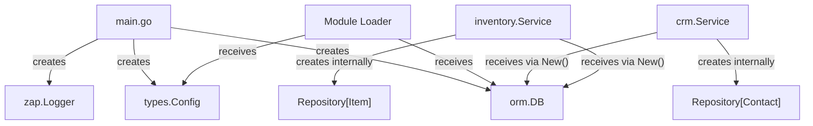

# Dependency Injection

!!! note "Implementation status"
    A formal DI container is not yet implemented. This page documents the current implicit dependency wiring approach and the direction EERP is moving toward.

---

## Purpose

Dependency injection is the practice of providing a component with its collaborators rather than having the component create them itself. In EERP, this matters because:

- Services need database access (`orm.DB`)
- Services may depend on other services
- Test instances need to swap real dependencies for test doubles
- Modules need to access core infrastructure without importing core packages

---

## Current Approach: Constructor Injection

EERP currently uses **constructor injection** — the idiomatic Go approach. Dependencies are passed as arguments to constructor functions. There is no container or framework.

```go
// core/modules/crm/internal/crm.go

type Service struct {
    contacts *orm.Repository[Contact]
    db       *orm.DB
}

func New(db *orm.DB) *Service {
    return &Service{
        contacts: orm.MustRepo[Contact](db),
        db:       db,
    }
}
```

Wiring happens in the entry point or module loader:

```go
// In main.go (illustrative)
db, _ := orm.Open(cfg, logger)
crmService := crm.New(db)
```

### Advantages

- No magic: the call stack is visible and traceable
- Compile-time type checking
- Easy to test: pass a test database or mock executor

### Limitations

- Wiring code grows linearly with the number of components
- Circular dependencies must be resolved manually
- Modules cannot access core services without an explicit hand-off mechanism

---

## Dependency Flow



---

## Module Dependency Access

Modules (WASM) cannot directly call Go functions. The mechanism for providing modules with access to core services is via **WASM host imports** — Go functions registered in the Wasmtime linker that the Rust module calls as if they were local functions.

For example, if a module needs to read a configuration value:

```
Rust module:
    extern "C" { fn get_config(key_ptr: *const u8, key_len: usize) -> *const u8; }

Go core registers:
    linker.FuncNew("env", "get_config", …, goFn)
```

This is the planned mechanism; currently the linker only exposes the migration protocol.

---

## Planned: Service Container

As the number of components grows, an explicit service container will be introduced. The likely approach is a simple struct-based container rather than a reflection-based framework:

```go
type Container struct {
    DB      *orm.DB
    Logger  *zap.Logger
    Config  *types.Config
    CRM     *crm.Service
    // ... other services
}

func BuildContainer(cfg *types.Config) (*Container, error) {
    db, err := orm.Open(buildOrmConfig(cfg), log.NewZapLogger(logger))
    if err != nil { return nil, err }

    return &Container{
        DB:     db,
        Logger: logger,
        Config: cfg,
        CRM:    crm.New(db),
    }, nil
}
```

This keeps wiring explicit and testable while giving a single place to find any component.

---

## Testing with Dependency Injection

Because dependencies are injected, swapping them in tests is straightforward:

```go
func TestContactCreate(t *testing.T) {
    // Use a test database (real DB, isolated schema)
    db := testutil.OpenTestDB(t)

    svc := crm.New(db)
    contact, err := svc.Create(ctx, crm.Contact{Name: "Alice"})
    require.NoError(t, err)
    assert.Equal(t, "Alice", contact.Name)
}
```

No mock framework required. The `orm.Executor` interface means you can also inject a transaction as the executor, giving test isolation without database cleanup.

---

## Extension Points

| Extension | How |
|---|---|
| Add a new injectable service | Add it to the wiring in `main.go` (or future `Container`) |
| Test double for a service | Define an interface at the call site; implement in tests |
| Module access to core services | Register a WASM host import in the Wasmtime linker |
