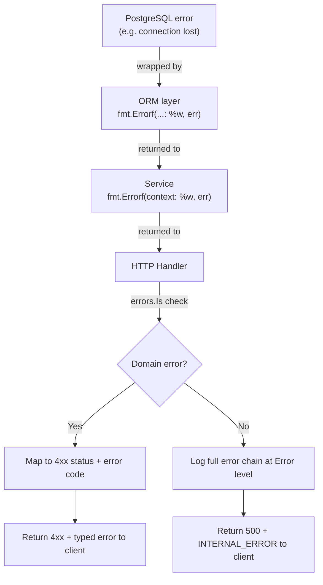

# Error Handling

EERP treats errors as values, not exceptions. Every function that can fail returns an error as its last return value. The system distinguishes between domain errors (meaningful to callers) and infrastructure errors (meaningful to operators).

---

## Purpose

Consistent error handling has two audiences:

1. **API clients** — need actionable information: what went wrong, what to fix
2. **Operators** — need diagnostic information: stack trace, context, cause

These audiences need different things, and the error handling layer ensures neither gets the other's information by accident.

---

## Responsibilities

- Classify errors into domain errors and infrastructure errors
- Prevent infrastructure error details from leaking to clients
- Log infrastructure errors with full context
- Map domain errors to HTTP status codes
- Provide a consistent error response format
- Recover from panics in handlers

---

## Error Classification

### Domain Errors

Domain errors represent conditions that are valid from the system's perspective — the request was understood, but the data or state doesn't allow the operation.

```go
// core/modules/crm/internal/crm.go (illustrative)
var (
    ErrContactNotFound  = errors.New("contact not found")
    ErrAlreadyCustomer  = errors.New("contact is already a customer")
    ErrInvalidStatus    = errors.New("invalid status transition")
)
```

Domain errors:
- Are defined as package-level `var` (or typed errors for extra data)
- Are compared with `errors.Is()`
- Map to specific HTTP status codes in the handler layer
- Are returned to API clients in the response body

### Infrastructure Errors

Infrastructure errors represent failures in the system (database down, network timeout, out of memory). They carry no meaning for the API client beyond "something went wrong on our side."

Infrastructure errors:
- Come from the ORM, pgx, the OS
- Are wrapped with context using `fmt.Errorf("doing X: %w", err)`
- Are logged at Error level with full details
- Are returned to API clients only as `500 Internal Server Error` with a request ID

---

## ORM Error Conventions

The ORM returns typed sentinel errors for common conditions:

```go
import "eerp/core/orm"

contact, err := contacts.FindByID(ctx, id)
if errors.Is(err, orm.ErrNotFound) {
    return Contact{}, ErrContactNotFound  // translate to domain error
}
if err != nil {
    return Contact{}, fmt.Errorf("fetching contact %s: %w", id, err)
}
```

| ORM Error | Meaning |
|---|---|
| `orm.ErrNotFound` | No row matched the query |
| `orm.ErrMultipleRows` | Expected one row, got more than one |
| `orm.ErrNoCondition` | UPDATE or DELETE attempted without WHERE clause |

---

## Error Wrapping Convention

All errors are wrapped with context as they propagate up the call stack:

```go
func (s *Service) ConvertToCustomer(ctx context.Context, id uuid.UUID) (Contact, error) {
    contact, err := s.contacts.FindByID(ctx, id)
    if err != nil {
        return Contact{}, fmt.Errorf("convert to customer: find contact: %w", err)
    }
    // ...
}
```

This produces a chain like:

```
http handler: convert to customer: find contact: orm: no rows returned
```

The handler logs the full chain at Error level and returns only the HTTP error to the client.

---

## HTTP Error Response Format

All API errors follow a consistent JSON structure:

```json
{
    "error": {
        "code": "CONTACT_NOT_FOUND",
        "message": "The requested contact does not exist.",
        "request_id": "01J..."
    }
}
```

| Field | Description |
|---|---|
| `code` | Machine-readable error code (uppercase snake_case) |
| `message` | Human-readable explanation safe to display to the user |
| `request_id` | Trace ID for correlation with server logs |

Infrastructure errors always use code `INTERNAL_ERROR` and a generic message:

```json
{
    "error": {
        "code": "INTERNAL_ERROR",
        "message": "An unexpected error occurred. Please try again later.",
        "request_id": "01J..."
    }
}
```

---

## HTTP Status Code Mapping

| Domain Error | HTTP Status |
|---|---|
| `orm.ErrNotFound` | `404 Not Found` |
| Validation error | `400 Bad Request` |
| `ErrAlreadyExists` | `409 Conflict` |
| `ErrForbidden` | `403 Forbidden` |
| `ErrUnauthenticated` | `401 Unauthorized` |
| Infrastructure error | `500 Internal Server Error` |

---

## Panic Recovery

The recovery middleware wraps every handler. If a handler panics:

1. The middleware recovers the panic
2. Logs the stack trace at Error level with the request ID
3. Returns `500 Internal Server Error` to the client

```go
func RecoverMiddleware(next http.Handler) http.Handler {
    return http.HandlerFunc(func(w http.ResponseWriter, r *http.Request) {
        defer func() {
            if v := recover(); v != nil {
                requestID := RequestIDFromContext(r.Context())
                logger.Error("handler panic",
                    zap.Any("panic", v),
                    zap.String("request_id", requestID),
                    zap.Stack("stack"),
                )
                writeErrorResponse(w, http.StatusInternalServerError, "INTERNAL_ERROR",
                    "An unexpected error occurred.", requestID)
            }
        }()
        next.ServeHTTP(w, r)
    })
}
```

---

## Logger

`core/internal/common/logs.go`

The global logger is a `go.uber.org/zap` instance initialized at startup:

```go
common.InitLogger(debug bool)
```

- `debug=true` → development encoder, Debug level, human-readable console output
- `debug=false` → production encoder, Info level, JSON output to `app.log`

All error logging uses structured fields:

```go
common.Logger.Error("module load failed",
    zap.String("module", module.Name),
    zap.String("version", module.Version),
    zap.Error(err),
)
```

---

## Error Flow Diagram



---

## Extension Points

| Extension | How |
|---|---|
| Custom error codes | Define typed errors in your module package; add cases to handler error mapper |
| Structured error data | Use `type MyError struct{ Field string }` with `Error() string` |
| Error translation | Middleware that converts ORM errors to domain errors before handlers see them |
| External error tracking | Add a Sentry or Datadog hook to the logger or recovery middleware |
