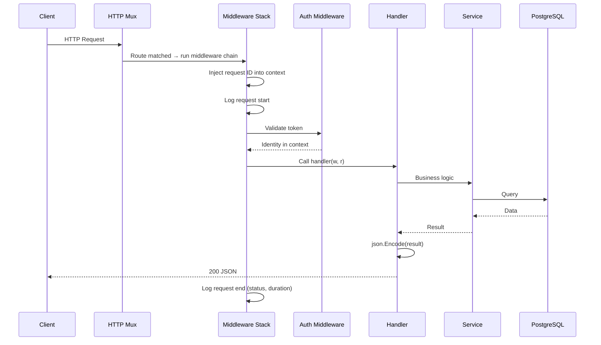

# HTTP Pipeline

!!! note "Implementation status"
    The HTTP server and middleware pipeline are currently in the design phase. This page documents the intended architecture. The core runtime starts up and loads modules; the HTTP layer is the next component to be built.

---

## Purpose

The HTTP pipeline is the boundary between the outside world and the core runtime. It translates HTTP requests into typed Go function calls, applies cross-cutting concerns (auth, logging, recovery), and translates return values back into HTTP responses.

---

## Responsibilities

- Accept and parse incoming HTTP requests
- Execute middleware in a defined order (logging → auth → permissions → handler)
- Route requests to the correct module handler
- Serialize responses to JSON
- Handle errors uniformly (see [Error Handling](error-handling.md))
- Provide observability (request ID, structured access logs)

---

## Intended Design

### Middleware Chain


Each middleware is a standard Go `http.Handler` wrapper. Middleware is composed at startup, not per-request.

### Request Context

Each middleware enriches a `context.Context` value that is passed down the chain:

| Key | Added by | Contents |
|---|---|---|
| `RequestID` | RequestID middleware | UUID for this request |
| `Identity` | Auth middleware | Authenticated user + tenant |
| `Permissions` | Permissions middleware | Effective permission set |

Handlers retrieve these via typed context accessors, not raw `context.Value(string)` calls.

---

## Lifecycle of a Request



---

## Response Format

All API responses follow a consistent envelope:

```json
{
    "data": { ... },
    "meta": {
        "request_id": "01J...",
        "timestamp": "2024-01-15T10:30:00Z"
    }
}
```

Errors follow a separate envelope — see [Error Handling](error-handling.md).

---

## Module Handler Registration

Each module that sets `"is_service": true` in `module.json` can register HTTP handlers with the core router. The registration API (called via WASM imports) looks like:

```
module calls: register_route(method, path, handler_id)
core exposes: route handler that calls back into WASM
```

The exact ABI is under design. The intent is that modules register routes at load time, and the core mux dispatches to WASM handler functions.

---

## Extension Points

| Extension | How |
|---|---|
| Custom middleware | Wrap the existing chain with a new `http.Handler` |
| Custom response format | Replace `JSONWriter` with an alternative serializer |
| WebSocket support | Register a dedicated WS handler before the middleware chain |
| Rate limiting | Add a rate-limit middleware before the Auth step |
