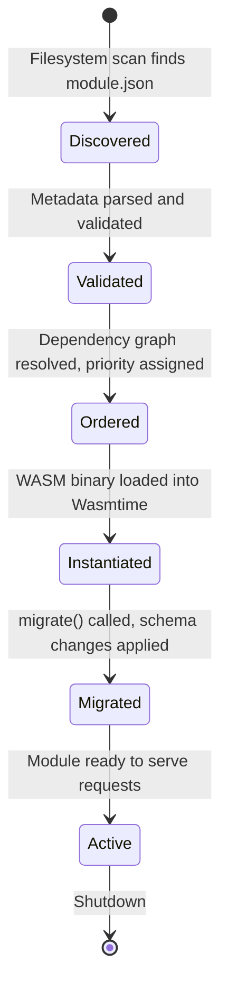
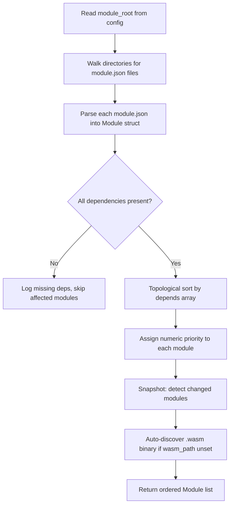
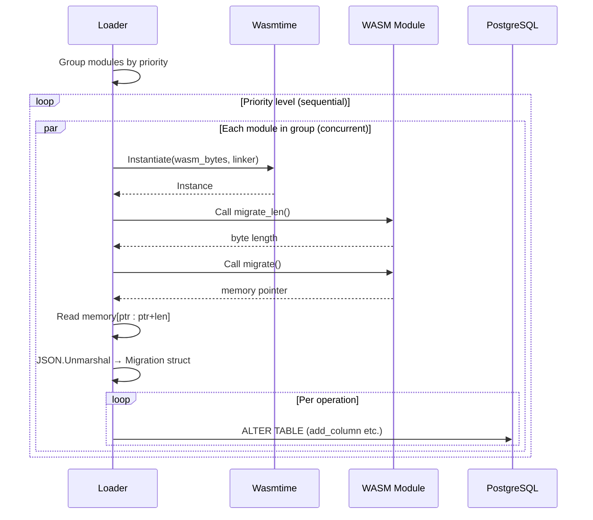
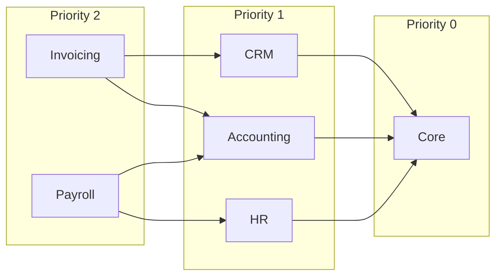
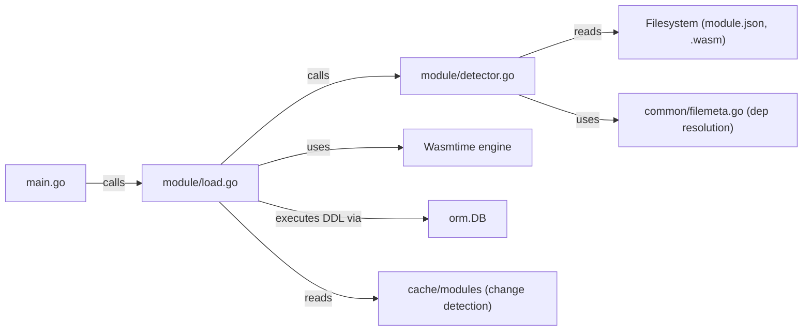

# Module System

The module system is the core extension mechanism of EERP. It allows independent business domains (CRM, Inventory, Accounting) to be developed, compiled, and deployed without modifying the core runtime.

---

## Purpose

In a traditional monolithic ERP, adding a new feature means modifying the core. Over time, this creates a tightly coupled system where business logic and infrastructure concerns are intertwined.

EERP solves this by treating the core as a **stable runtime** and business features as **pluggable WASM binaries**. The core provides infrastructure (database, HTTP, auth); modules provide business logic.

---

## Responsibilities

- Discover modules by scanning the filesystem
- Validate module metadata and resolve dependencies
- Load and instantiate WASM binaries in a sandboxed environment
- Apply per-module database schema migrations
- Define the contract (ABI) between modules and the core

---

## Module Anatomy

A module is a directory containing two required files:

```
modules/crm/
├── module.json       # Module metadata and dependency declaration
├── crm.wasm          # Compiled Rust binary (auto-discovered)
└── src/              # Rust source (not read by core)
    └── lib.rs
```

### module.json

```json
{
    "active": true,
    "name": "crm",
    "display_name": "CRM",
    "version": "0.0.1",
    "author": "Edwin Lecomte",
    "description": "CRM core module",
    "depends": [],
    "priority": 0,
    "static_files": {},
    "is_service": true,
    "auto_install": true
}
```

| Field | Type | Description |
|---|---|---|
| `active` | bool | Whether the module should be loaded |
| `name` | string | Unique identifier (used in dependency resolution) |
| `display_name` | string | Human-readable name |
| `version` | semver | Module version |
| `depends` | []string | Names of modules that must be loaded first |
| `priority` | int | Manual priority hint (rarely needed; dependency resolver assigns priorities) |
| `is_service` | bool | Whether the module registers HTTP handlers |
| `auto_install` | bool | Whether to apply migrations automatically on load |

---

## Lifecycle



---

## Detection Flow

`core/internal/module/detector.go`



### Snapshot-based Change Detection

The detector maintains a cache of the previous scan in `./cache/modules`. On each startup, it compares the current filesystem state with the cached state:

- **New module**: load and migrate
- **Changed module** (different hash): reload
- **Unchanged module**: skip migration (idempotent operations still safe)
- **Removed module**: mark inactive

### Priority Assignment

Modules in the same dependency tier get the same priority number. The algorithm:

1. Assign priority 0 to all modules with no dependencies.
2. For each remaining module, assign `max(dependencies' priorities) + 1`.
3. Repeat until all modules have a priority.

Modules at priority _N_ load concurrently; priority _N+1_ waits for all of _N_ to complete.

---

## Loading Flow

`core/internal/module/load.go`



---

## Migration Protocol

Modules communicate schema requirements through a simple memory-based protocol. This avoids a direct Go/Rust dependency; the only shared contract is the JSON shape.

### Module side (Rust)

```rust
// The migration definition, returned as JSON in linear memory
static MIGRATION: &str = r#"{
    "entity": "contacts",
    "version": 1,
    "operations": [
        {
            "type": "add_column",
            "table": "contacts",
            "column": "crm_segment",
            "sql_type": "VARCHAR(64)",
            "nullable": true
        }
    ]
}"#;

#[no_mangle]
pub extern "C" fn migrate() -> *const u8 {
    MIGRATION.as_ptr()
}

#[no_mangle]
pub extern "C" fn migrate_len() -> usize {
    MIGRATION.len()
}
```

### Core side (Go)

```go
// core/internal/types/modules.go
type Migration struct {
    Entity     string      `json:"entity"`
    Version    int         `json:"version"`
    Operations []Operation `json:"operations"`
}

type Operation struct {
    Type     string `json:"type"`     // currently: "add_column"
    Table    string `json:"table"`
    Column   string `json:"column"`
    SQLType  string `json:"sql_type"`
    Nullable bool   `json:"nullable"`
}
```

The core reads the WASM linear memory region indicated by the pointer and length, deserializes the JSON, and applies each operation using parameterized DDL statements.

### Supported Operations

| Operation | DDL Generated |
|---|---|
| `add_column` | `ALTER TABLE t ADD COLUMN IF NOT EXISTS col TYPE` |

Future operations planned: `drop_column`, `add_index`, `create_table`, `rename_column`.

---

## Dependency Resolution

`core/internal/common/filemeta.go`



The resolver also validates that all declared dependencies are present:

```go
ok, missing := fmMap.CheckDependencies()
// missing = map[depName][]modulesThatNeedIt
```

Missing dependencies cause the dependent module to be skipped, not the entire system.

---

## Interactions



---

## Extension Points

| Extension | Mechanism |
|---|---|
| New operation type | Add case to `Operation.Type` handler in `load.go` |
| New WASM export | Export function from Rust, call from `load.go` |
| Hot reload | Future: watch `module_root` with `fsnotify`, re-instantiate on change |
| Module isolation | Future: per-module Wasmtime store with resource limits |
| Module API | Future: Go functions linked into WASM linker, called from Rust via imports |

---

## Security Considerations

WASM modules run inside a Wasmtime sandbox. They cannot:

- Access the host filesystem directly
- Open network connections
- Crash the Go process on panic

They can only communicate with the core through the defined ABI (exported functions + linear memory) and through imported host functions that the core explicitly exposes via the Wasmtime linker.
