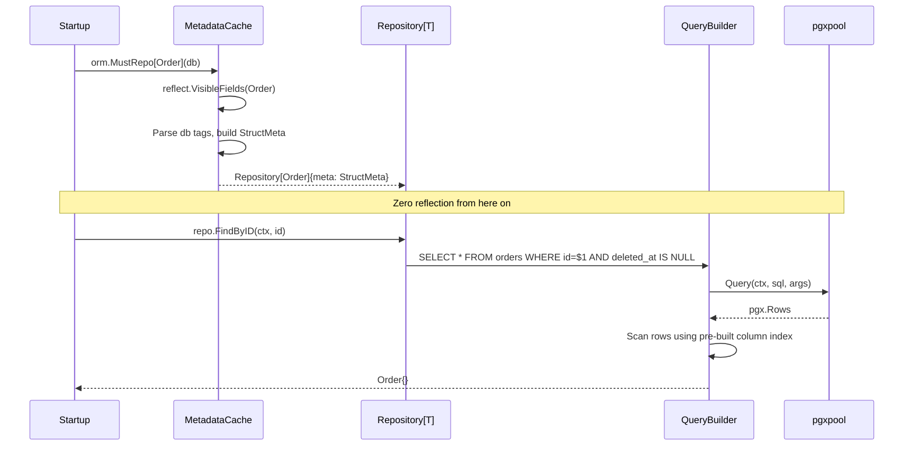
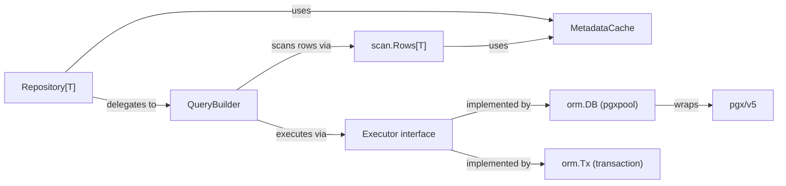

# ORM

The EERP ORM is a custom data access layer built on top of [pgx v5](https://github.com/jackc/pgx). It provides type-safe CRUD operations, composable query builders, transactions with savepoints, and soft-delete — all without reflection at query time.

---

## Purpose

Standard Go ORMs (GORM, ent) solve the general case. EERP's ORM solves a more specific case: an ERP system where:

- Every entity needs audit fields (created/updated/deleted timestamps, UUID primary key)
- Soft-delete is the norm, hard delete is the exception
- Transactions frequently need partial rollback via savepoints
- Startup cost is acceptable; per-query reflection is not
- The query layer must be composable but never hide what SQL it generates

See [ADR-001](../adrs/001-custom-orm.md) for the full rationale.

---

## Responsibilities

- Map Go structs to database rows and back
- Build parameterized SQL from a fluent builder API
- Manage connection pool lifecycle
- Provide transactional boundaries (including savepoints)
- Log all queries (optionally)
- Cache all struct metadata at startup

---

## Lifecycle



---

## Core Concepts

### Entity and BaseModel

Every ORM-managed struct embeds `model.BaseModel`:

```go
import "eerp/core/orm/model"

type Order struct {
    model.BaseModel          // (1)
    CustomerID uuid.UUID `db:"customer_id"`
    Status     string    `db:"status"`
    TotalCents int64     `db:"total_cents"`
}

func (Order) TableName() string { return "orders" } // (2)
```

1. `BaseModel` contributes four columns: `id` (UUID, PK), `created_at`, `updated_at`, `deleted_at`.
2. If `TableName()` is not implemented, the table name is derived as `snake_case(TypeName)`.

`BaseModel` provides:

| Field | Type | DB Column | Behaviour |
|---|---|---|---|
| `ID` | `uuid.UUID` | `id` | Auto-generated on INSERT |
| `CreatedAt` | `time.Time` | `created_at` | Set on INSERT |
| `UpdatedAt` | `time.Time` | `updated_at` | Set on INSERT and UPDATE |
| `DeletedAt` | `*time.Time` | `deleted_at` | nil = active; non-nil = soft-deleted |

### Struct Tags

| Tag | Meaning |
|---|---|
| `db:"col"` | Explicit column name |
| `db:"col,pk"` | Primary key |
| `db:"col,omitempty"` | Skip field when value is the zero value |
| `db:"col,softdelete"` | Marks the soft-delete timestamp column |
| `db:"-"` | Exclude from all queries |

If no `db` tag is present, the column name is the snake_case conversion of the field name.

### MetadataCache

`orm/internal/cache/cache.go` holds a global `sync.Map` keyed by `reflect.Type`. The first call to `MustRepo[T]` computes a `StructMeta` for `T` and stores it. All subsequent calls return the cached value.

`StructMeta` contains:
- Table name
- Ordered list of `FieldMeta` (field pointer, column name, flags)
- A `columnIndex` map for O(1) lookup during scanning

After startup, zero reflection occurs in the hot path.

---

## Repository

`orm/repo/repository.go`

The `Repository[T]` is the primary interface for CRUD operations. Construct one per entity at application startup:

```go
orders := orm.MustRepo[Order](db)   // panics on misconfigured tags
```

`MustRepo` is appropriate at startup because misconfigured repositories are programming errors, not runtime conditions.

### Read Operations

All reads exclude soft-deleted rows (`deleted_at IS NULL`) automatically.

```go
// Single row by primary key
order, err := orders.FindByID(ctx, id)

// First row matching a condition
open, err := orders.FindOne(ctx, orm.Cond("status = $1", "open"))

// All rows
all, err := orders.FindAll(ctx)

// All rows matching a condition
pending, err := orders.FindAll(ctx, orm.Cond("status = $1", "pending"))

// Count
n, err := orders.Count(ctx)
n, err := orders.Count(ctx, orm.Cond("status = $1", "open"))
```

### Write Operations

```go
// INSERT … RETURNING *
created, err := orders.Create(ctx, order)

// UPDATE … WHERE id=$1 RETURNING *
updated, err := orders.Update(ctx, order, id)

// Soft-delete: sets deleted_at = NOW()
n, err := orders.Delete(ctx, id)

// Hard delete: DELETE FROM orders WHERE id=$1
n, err := orders.HardDelete(ctx, id)

// Restore: clears deleted_at
err = orders.Restore(ctx, id)
```

### Batch Operations

```go
// Single INSERT with multiple rows, one round-trip
created, err := orders.CreateBatch(ctx, []Order{o1, o2, o3})
```

### Scoping to a Transaction

```go
err = orm.Transact(ctx, db, func(tx *orm.Tx) error {
    txOrders := orders.WithTx(tx)   // shallow copy, same meta, different executor
    _, err := txOrders.Create(ctx, order)
    return err
})
```

---

## Query Builders

When `Repository` methods are not expressive enough, drop down to the builder API. Builders are **immutable value types** — safe to branch and reuse.

### SELECT

```go
results, err := orm.Select[Order](orders.Meta()).
    Columns("id", "status", "total_cents").   // default: all mapped columns
    Join("JOIN customers c ON c.id = o.customer_id").
    Where(orm.Cond("c.region = $1", "EU")).
    Where(orm.Cond("o.status != $1", "cancelled")).
    OrderBy("created_at DESC").
    Limit(50).
    Offset(page * 50).
    All(ctx, db)

// Single row
one, err := builder.One(ctx, db)

// COUNT(*) — strips ORDER BY, LIMIT, OFFSET automatically
n, err := builder.Count(ctx, db)
```

Multiple `Where()` calls are joined with `AND`. Placeholder numbers (`$1`, `$2`) in each condition are **rebased** automatically so they don't conflict.

### INSERT

```go
// Single row
created, err := orm.Insert[Order](orders.Meta(), order).
    Returning("*").
    One(ctx, db)

// Multiple rows (VALUES (…), (…), …) — one round-trip
all, err := orm.Insert[Order](orders.Meta(), o1, o2, o3).
    Returning("id", "created_at").
    Batch(ctx, db)

// Upsert: on conflict do nothing
err = orm.Insert[Order](orders.Meta(), order).
    OnConflictDoNothing().
    Exec(ctx, db)

// Upsert: on conflict update
updated, err := orm.Insert[Order](orders.Meta(), order).
    OnConflict("id").DoUpdate("status = EXCLUDED.status").
    Returning("*").
    One(ctx, db)
```

### UPDATE

```go
// Explicit column assignment
tag, err := orm.Update[Order](orders.Meta()).
    Set("status", "shipped").
    Set("updated_at", time.Now()).
    Where(orm.Cond("id = $1", id)).
    Exec(ctx, db)

// From a full struct (PK excluded, zero-value fields with omitempty skipped)
updated, err := orm.Update[Order](orders.Meta()).
    FromStruct(order).
    Where(orm.Cond("id = $1", id)).
    Returning("*").
    One(ctx, db)
```

!!! warning "Safety check"
    `Update.ToSQL()` returns an error if no `Where()` has been called. Accidental full-table updates are refused at build time.

### DELETE

```go
// Hard delete with condition
n, err := orm.Delete[Order](orders.Meta()).
    Where(orm.Cond("id = $1", id)).
    Exec(ctx, db)

// With RETURNING for audit
deleted, err := orm.Delete[Order](orders.Meta()).
    Where(orm.Cond("status = $1", "cancelled")).
    Returning("id", "customer_id").
    All(ctx, db)
```

!!! warning "Safety check"
    `Delete.ToSQL()` returns an error if no `Where()` has been called.

---

## Transactions and Savepoints

`orm/pool/tx/tx.go`

```go
err = orm.Transact(ctx, db, func(tx *orm.Tx) error {
    txOrders := orders.WithTx(tx)
    txLines  := lines.WithTx(tx)

    // Savepoint for partial rollback
    if err := tx.Savepoint(ctx, "order_lines"); err != nil {
        return err
    }

    if err := createLines(ctx, txLines, lineItems); err != nil {
        // Roll back only the lines, keep the order
        if rbErr := tx.RollbackTo(ctx, "order_lines"); rbErr != nil {
            return rbErr
        }
        return applyFallback(ctx, txOrders, txLines)
    }

    return tx.Release(ctx, "order_lines")
})
```

Semantics:
- `fn` returns `nil` → `COMMIT`
- `fn` returns error → `ROLLBACK`, error is returned to caller
- Savepoints enable partial rollback within a transaction

---

## Logging

```go
import "eerp/core/orm/log"

// Production: log only errors
db, err := orm.Open(cfg, log.NewNoopLogger())

// Development: log every query
db, err := orm.Open(cfg, log.NewZapLogger(zapLogger))
```

The `Logger` interface is minimal:

```go
type Logger interface {
    Log(ctx context.Context, entry LogEntry)
}

type LogEntry struct {
    SQL      string
    Args     []any
    Duration time.Duration
    Err      error
}
```

---

## Interactions



---

## Extension Points

| Extension | How |
|---|---|
| Custom query logic | Use `SelectBuilder` / `InsertBuilder` directly instead of `Repository` |
| Custom logger | Implement `orm/log.Logger`, pass to `orm.Open` |
| Custom base model | Implement the `model.Entity` constraint; `BaseModel` is not mandatory |
| Custom table name | Implement `TableName() string` on the struct |
| Hooks before/after writes | Wrap `Repository` in your own service type |
