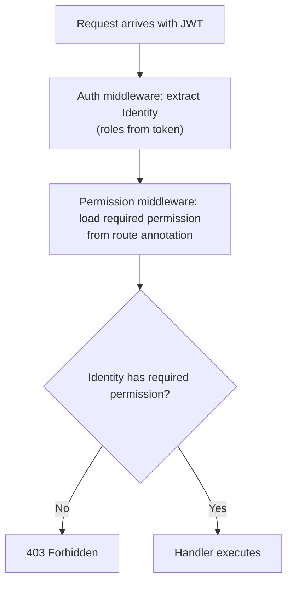
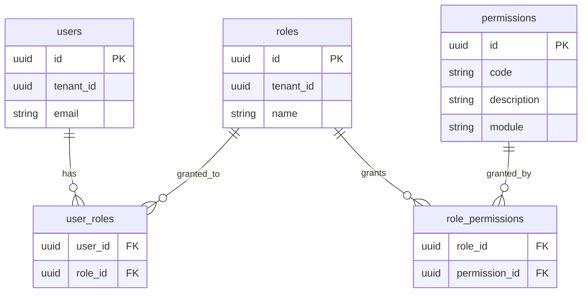
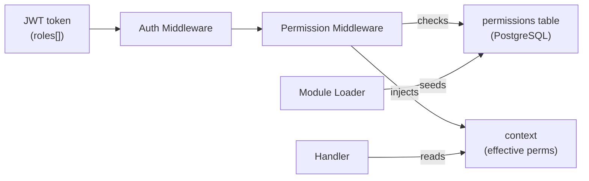

# Permissions

!!! note "Implementation status"
    The permissions system is planned. The role claims in the JWT token (see [Authentication](authentication.md)) are the foundation. The enforcement middleware and the permission DSL are not yet implemented.

---

## Purpose

Authentication establishes _who_ is making a request. Permissions answer _what that identity is allowed to do_. The two are distinct layers: authentication is always required first; permissions are applied per endpoint.

---

## Responsibilities

- Define the permission model (roles, resources, actions)
- Check permissions before executing handlers
- Enforce tenant isolation (no cross-tenant access)
- Allow modules to declare their own permissions
- Provide a simple API for handlers to perform ad-hoc checks

---

## Permission Model

EERP uses **role-based access control (RBAC)** as the foundation, with per-resource action scoping:

```
permission = role + ":" + resource + ":" + action
```

Examples:

| Permission | Meaning |
|---|---|
| `crm:contacts:read` | Read contacts in the CRM module |
| `crm:contacts:write` | Create and update contacts |
| `crm:contacts:delete` | Soft-delete contacts |
| `inventory:items:read` | Read inventory items |
| `*:*:read` | Read anything (super-admin read access) |

Roles are assigned to users at the tenant level. A user may have multiple roles. The effective permission set is the union of all permissions granted by all roles.

---

## Role Declaration by Modules

Modules declare the roles and permissions they define via their `module.json`:

```json
{
    "name": "crm",
    "permissions": [
        { "id": "crm:contacts:read",   "description": "View contacts" },
        { "id": "crm:contacts:write",  "description": "Create and edit contacts" },
        { "id": "crm:contacts:delete", "description": "Archive contacts" }
    ],
    "default_roles": {
        "crm_user":  ["crm:contacts:read", "crm:contacts:write"],
        "crm_admin": ["crm:contacts:read", "crm:contacts:write", "crm:contacts:delete"]
    }
}
```

The core reads these declarations at module load time and seeds the permissions table in PostgreSQL.

---

## Enforcement Flow



---

## Route Annotation

Permissions are declared alongside routes. The exact mechanism depends on how the router is implemented:

```go
// Core routes (illustrative)
router.GET("/api/v{api_version}/crm/",     handler.ListContacts,   require("crm:contacts:read"))
router.POST("/api/v{api_version}/crm/",    handler.CreateContact,  require("crm:contacts:write"))
router.DELETE("/api/v{api_version}/crm/{id}", handler.DeleteContact, require("crm:contacts:delete"))
```

For WASM module routes, permissions are declared at route registration time:

```rust
register_route("GET", "/contacts", handler_id=1, permission="crm:contacts:read")
```

---

## Ad-Hoc Permission Checks in Handlers

For fine-grained checks that depend on the requested resource (e.g., a user can only edit their own contacts):

```go
func (h *Handler) UpdateContact(w http.ResponseWriter, r *http.Request) {
    identity := auth.MustIdentity(r.Context())
    contact, err := h.svc.GetByID(r.Context(), id)
    if err != nil { /* … */ }

    // Resource-level check beyond RBAC
    if contact.TenantID != identity.TenantID {
        http.Error(w, "forbidden", http.StatusForbidden)
        return
    }

    // Proceed
}
```

---

## Tenant Isolation

Tenant isolation is enforced at two levels:

1. **Token level**: The JWT contains `tenant_id`. All permission checks are scoped to that tenant.
2. **Query level**: Every service filters by `tenant_id` from the identity context.

A user from tenant A cannot access tenant B's data even if they somehow obtain a valid token for tenant A, because every query includes `WHERE tenant_id = $1` with the value from their token.

---

## Permission Storage



Roles and permissions are stored in PostgreSQL. The token contains role names; the middleware resolves the effective permission set by joining `user_roles` → `role_permissions` → `permissions` once per session (result can be cached in the token or in a short-lived in-memory cache).

---

## Interactions



---

## Extension Points

| Extension | How |
|---|---|
| Attribute-based access control (ABAC) | Add resource attributes to the `require()` check; evaluate policy rules |
| Permission caching | Cache resolved permission sets keyed by `(user_id, tenant_id)` with short TTL |
| Audit logging | Hook the permission check to write `(user, action, resource, allowed, timestamp)` |
| Dynamic roles | Allow tenants to create custom roles via the permissions API |
