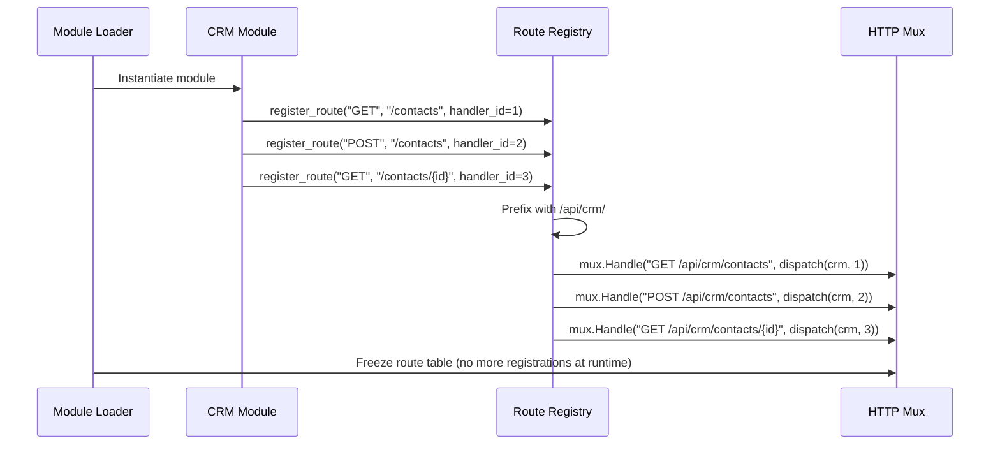
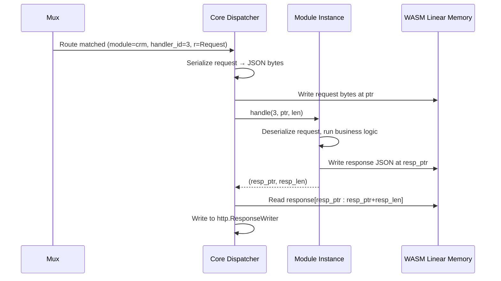

# Automatic Router

!!! note "Implementation status"
    The automatic router is a planned component. This page documents the intended design based on the module system architecture and the principle that modules declare their routes rather than the core knowing about them.

---

## Purpose

In a module-based ERP, routes cannot be hardcoded in the core — modules don't exist yet when the core compiles. The automatic router solves this by letting modules **declare** routes at load time, which the core then wires into the HTTP mux.

---

## Responsibilities

- Maintain a route table that maps `(method, path)` to a module handler
- Accept route registrations from modules at load time
- Namespace module routes automatically to prevent collisions
- Generate an API schema (OpenAPI) from registered routes
- Handle path parameters (`/orders/{id}`) and query parameters
- Enforce that no two modules register the same route

---

## Route Namespace Convention

Every module's routes are automatically prefixed with `/api/{module_name}/`:

| Module | Declared path | Effective path |
|---|---|---|
| `crm` | `/contacts` | `/api/crm/contacts` |
| `crm` | `/contacts/{id}` | `/api/crm/contacts/{id}` |
| `inventory` | `/items` | `/api/inventory/items` |

This prevents collisions without requiring module authors to know about other modules.

---

## Route Registration Flow

After all modules have loaded, the route table is frozen. New routes cannot be registered without a restart.

---

## Handler Dispatch

When a request arrives at a module route, the core:

1. Extracts the matched `handler_id` and module instance
2. Serializes the request (headers, path params, body) into a WASM-compatible format
3. Calls the module's `handle(handler_id, request_ptr, request_len)` export
4. Reads the response from WASM linear memory
5. Writes the response to the HTTP response writer

---

## Core Routes

The core itself registers a small number of routes outside the module namespace:

| Method | Path | Purpose |
|---|---|---|
| `GET` | `/health` | Liveness probe |
| `GET` | `/ready` | Readiness probe (DB connectivity) |
| `GET` | `/api/modules` | List loaded modules and their versions |
| `POST` | `/api/auth/login` | Issue an authentication token |
| `POST` | `/api/auth/refresh` | Refresh a token |

---

## Extension Points

| Extension | How |
|---|---|
| Custom path prefix | Override module name prefix via `module.json` `route_prefix` field |
| Route middleware | Apply per-module middleware by wrapping the dispatcher |
| OpenAPI generation | Walk the route table post-load and emit an OpenAPI 3 spec |
| GraphQL | Register a single `/graphql` handler in the core that routes to a schema stitched from module-declared types |
