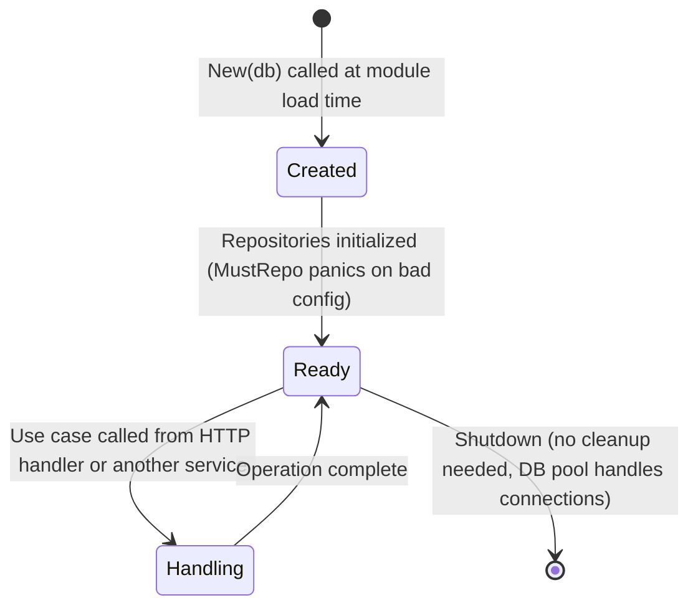
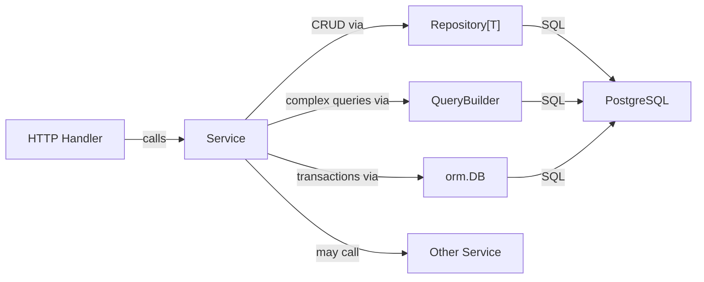

# Services

A service is the Go struct that owns a business domain. It holds typed repositories, implements use cases, and enforces domain invariants. Services are the layer between HTTP handlers (above) and the ORM (below).

---

## Purpose

Business logic must live somewhere. Putting it in handlers makes handlers untestable and hard to reuse. Putting it in repositories mixes data access concerns with business rules. Services are the dedicated home for business logic.

---

## Responsibilities

- Implement use cases (Create Order, Convert Lead, Calculate Invoice)
- Enforce domain invariants (an order cannot ship without a delivery address)
- Compose repository operations into atomic transactions
- Call other services for cross-domain operations (rarely; prefer events)
- Return domain errors meaningful to the caller

---

## Anatomy of a Service

The CRM module's `Service` is the reference implementation (`core/modules/crm/internal/crm.go`):

```go
type Service struct {
    contacts *orm.Repository[Contact]  //(1)
    db       *orm.DB                   //(2)
}

func New(db *orm.DB) *Service {        //(3)
    return &Service{
        contacts: orm.MustRepo[Contact](db),
        db:       db,
    }
}
```

1. Typed repository for the `Contact` entity. Created once at startup.
2. Raw DB handle needed for multi-entity transactions.
3. Constructor receives only what it needs; the caller owns the DB.

---

## Use Case Implementation Patterns

### Simple CRUD

Thin wrapper around the repository. Use when the operation has no invariants beyond what the database enforces.

```go
func (s *Service) Create(ctx context.Context, c Contact) (Contact, error) {
    return s.contacts.Create(ctx, c)
}

func (s *Service) GetByID(ctx context.Context, id uuid.UUID) (Contact, error) {
    return s.contacts.FindByID(ctx, id)
}

func (s *Service) Delete(ctx context.Context, id uuid.UUID) error {
    _, err := s.contacts.Delete(ctx, id)
    return err
}
```

### Query with Business Rules

Use query builders when the filter logic is domain-specific.

```go
// Only return active contacts for a company
func (s *Service) ListByCompany(ctx context.Context, company string) ([]Contact, error) {
    return s.contacts.Query().
        Where(orm.Cond("company = $1", company)).
        OrderBy("name ASC").
        All(ctx, s.db)
}
```

!!! note
    `Repository.FindAll()` already excludes soft-deleted rows. Builder queries must explicitly include `deleted_at IS NULL` if using raw builders that bypass the repository's default conditions — or call `repo.Query()` which inherits the soft-delete filter.

### State Machine Transition

When an operation changes entity state and must be atomic:

```go
func (s *Service) ConvertToCustomer(ctx context.Context, id uuid.UUID) (Contact, error) {
    var result Contact
    err := orm.Transact(ctx, s.db, func(tx *orm.Tx) error {
        txContacts := s.contacts.WithTx(tx)

        contact, err := txContacts.FindByID(ctx, id)
        if err != nil {
            return err
        }

        if contact.Status == "customer" {
            return ErrAlreadyCustomer
        }

        contact.Status = "customer"
        result, err = txContacts.Update(ctx, contact, id)
        return err
    })
    return result, err
}
```

### Multi-Entity Operation

When one use case spans multiple entities:

```go
type OrderService struct {
    orders    *orm.Repository[Order]
    lines     *orm.Repository[OrderLine]
    inventory *orm.Repository[InventoryItem]
    db        *orm.DB
}

func (s *OrderService) Submit(ctx context.Context, order Order, lines []OrderLine) (Order, error) {
    var created Order
    err := orm.Transact(ctx, s.db, func(tx *orm.Tx) error {
        txOrders    := s.orders.WithTx(tx)
        txLines     := s.lines.WithTx(tx)
        txInventory := s.inventory.WithTx(tx)

        if err := s.validateLines(ctx, txInventory, lines); err != nil {
            return err
        }

        var err error
        created, err = txOrders.Create(ctx, order)
        if err != nil { return err }

        for i := range lines {
            lines[i].OrderID = created.ID
        }
        if _, err := txLines.CreateBatch(ctx, lines); err != nil {
            return err
        }

        return s.reserveInventory(ctx, txInventory, lines)
    })
    return created, err
}
```

---

## Service Lifecycle



Services are **stateless** after construction. The only state they hold is the repository and DB references, which are themselves stateless (the pool manages actual connections).

---

## Error Handling in Services

Services return typed errors for domain conditions, untyped errors for infrastructure failures:

```go
var (
    ErrContactNotFound  = errors.New("contact not found")
    ErrAlreadyCustomer  = errors.New("contact is already a customer")
    ErrInvalidStatus    = errors.New("invalid status transition")
)

func (s *Service) ConvertToCustomer(ctx context.Context, id uuid.UUID) (Contact, error) {
    contact, err := s.contacts.FindByID(ctx, id)
    if errors.Is(err, orm.ErrNotFound) {
        return Contact{}, ErrContactNotFound  // domain error
    }
    if err != nil {
        return Contact{}, err  // infrastructure error — caller decides
    }
    // ...
}
```

The HTTP handler layer maps domain errors to HTTP status codes. Infrastructure errors become 500s. See [Error Handling](error-handling.md).

---

## Interactions



---

## Extension Points

| Extension | How |
|---|---|
| Hooks before/after writes | Wrap the service with a decorator that calls the hook |
| Event emission after state changes | Emit to a channel or event bus inside the transaction, flush on commit |
| Cross-module calls | Inject the other module's service via constructor; keep interfaces small |
| Caching | Wrap `FindByID` with a cache layer in a decorator service |
