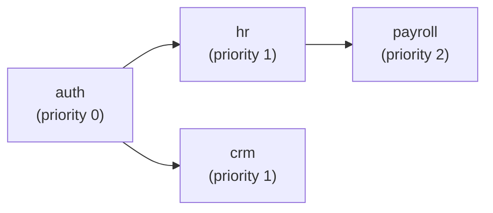

# Creating a Go Module (Monolith Path)

!!! info "Two paths available"
    EERP supports two module implementation strategies:

    - **Go monolith** (this guide) — schema declared in Go, all logic compiled directly into the core binary. This is the current approach for all shipped modules (CRM, etc.).
    - **WASM / Rust** ([Creating a WASM Module](creating-a-module.md)) — Rust crate compiles to `.wasm`; the core calls `migrate()` at startup for sandboxed schema declaration.

This guide walks you through building a Go module from scratch. We'll build a `hr` (Human Resources) module as a running example, mirroring the pattern used by the CRM module (`core/modules/crm/internal/crm.go`).

---

## Before You Start

You need:

- Go 1.26+ with generics support
- A running PostgreSQL instance (see `compose.yml`)
- The EERP core repository checked out

No additional toolchain is required — Go modules compile directly into the core binary.

---

## Step 1: Create the Module Directory

```bash
mkdir -p core/modules/hr/internal
```

Your module lives under `core/modules/` alongside the existing CRM module:

```
core/modules/
├── crm/
│   └── internal/
│       └── crm.go      # Reference implementation
└── hr/
    ├── module.json     # Metadata (required by detector)
    └── internal/
        ├── employee.go # Entity definition
        └── service.go  # Business logic
```

---

## Step 2: Write module.json

The detector scans `module_root` directories for `module.json` files. Even for Go-only modules, this file is required for dependency resolution and priority assignment.

```json
{
    "active": true,
    "name": "hr",
    "display_name": "Human Resources",
    "version": "0.1.0",
    "author": "Your Name",
    "description": "Employee and contract management",
    "depends": [],
    "priority": 0,
    "static_files": {},
    "is_service": true,
    "auto_install": true
}
```

**Field reference:**

| Field | Type | Description |
|---|---|---|
| `active` | bool | Whether the module loads on startup |
| `name` | string | Unique identifier — used in `depends` arrays |
| `display_name` | string | Human-readable label |
| `version` | semver | Module version |
| `depends` | []string | Names of modules that must load before this one |
| `is_service` | bool | Whether the module registers HTTP handlers |
| `auto_install` | bool | Whether to apply migrations automatically on load |

!!! note "No wasm_path needed"
    For a pure Go module, omit `wasm_path`. The detector auto-discovers `.wasm` files; if none is found, the WASM migration step is skipped and the Go service handles everything.

**Checklist:**

- [ ] `name` is unique across all modules in `module_root`
- [ ] `depends` lists the `name` values of prerequisite modules
- [ ] `active: true` to enable on startup

---

## Step 3: Define the Entity

Entities embed `model.BaseModel`, which provides `id` (UUID), `created_at`, `updated_at`, and `deleted_at` (soft-delete) automatically.

**`internal/employee.go`:**

```go
package hr

import (
    "eerp/core/orm/model"
    "time"
)

// Employee represents a person hired by the business.
// The ORM derives the table name from TableName() below.
type Employee struct {
    model.BaseModel
    Department  string    `db:"department"`
    StartDate   time.Time `db:"start_date"`
    SalaryCents int64     `db:"salary_cents"` // stored in cents to avoid float precision issues
    Status      string    `db:"status"`       // "active" | "on_leave" | "terminated"
}

func (Employee) TableName() string { return "employees" }
```

**Rules:**

- Embed `model.BaseModel` — never define `id`, `created_at`, `updated_at`, or `deleted_at` yourself.
- Use `db:"column_name"` struct tags for non-snake-case field names.
- Implement `TableName() string` to override the default (struct name lowercased).
- Store money as integer cents, not `float64`.

**`model.BaseModel` fields (for reference):**

```go
// core/orm/model/base.go
type BaseModel struct {
    ID        uuid.UUID  `db:"id"`
    CreatedAt time.Time  `db:"created_at"`
    UpdatedAt time.Time  `db:"updated_at"`
    DeletedAt *time.Time `db:"deleted_at"` // nil = active
}
```

---

## Step 4: Declare the Database Schema

For Go modules, the schema declaration lives in Go rather than in a Rust `.wasm` binary. You have two options:

### Option A: Go-side migration struct (recommended for monolith)

Define the migration as a Go value and apply it directly at service startup:

```go
// internal/migration.go
package hr

import "core/internal/types"

var Migration = types.Migration{
    Entity:  "employees",
    Version: 1,
    Operations: []types.Operation{
        {Type: "add_column", Table: "employees", Column: "department",   SQLType: "VARCHAR(128)", Nullable: false},
        {Type: "add_column", Table: "employees", Column: "start_date",   SQLType: "DATE",         Nullable: false},
        {Type: "add_column", Table: "employees", Column: "salary_cents", SQLType: "BIGINT",        Nullable: false},
        {Type: "add_column", Table: "employees", Column: "status",       SQLType: "VARCHAR(32)",   Nullable: false},
    },
}
```

Pass this to the migration applier in `main.go` (see Step 7).

### Option B: Raw SQL migration file

For complex schemas (indexes, constraints, foreign keys), write a raw SQL file and execute it at startup:

```sql
-- modules/hr/schema.sql
CREATE TABLE IF NOT EXISTS employees (
    id            UUID PRIMARY KEY DEFAULT gen_random_uuid(),
    created_at    TIMESTAMPTZ NOT NULL DEFAULT now(),
    updated_at    TIMESTAMPTZ NOT NULL DEFAULT now(),
    deleted_at    TIMESTAMPTZ,
    department    VARCHAR(128) NOT NULL,
    start_date    DATE NOT NULL,
    salary_cents  BIGINT NOT NULL,
    status        VARCHAR(32) NOT NULL
);

CREATE INDEX IF NOT EXISTS employees_department_idx ON employees (department);
CREATE INDEX IF NOT EXISTS employees_status_idx ON employees (status);
```

!!! warning "No auto-create"
    The ORM's `MustRepo` call does not auto-create the base table. Use one of the options above to ensure the table exists before the service starts.

---

## Step 5: Implement Business Logic

The service wraps one or more `orm.Repository[T]` instances and exposes business operations.

**`internal/service.go`:**

```go
package hr

import (
    "context"
    "errors"

    "core/orm"

    "github.com/google/uuid"
)

var ErrEmployeeNotFound = errors.New("employee not found")

// Service holds the HR business logic, wired to the database at startup.
type Service struct {
    employees *orm.Repository[Employee]
    db        *orm.DB
}

// New wires the HR service to the database.
// Call once at startup — panics if Employee struct tags are invalid.
func New(db *orm.DB) *Service {
    return &Service{
        employees: orm.MustRepo[Employee](db),
        db:        db,
    }
}

// Hire creates a new active employee record.
func (s *Service) Hire(ctx context.Context, e Employee) (Employee, error) {
    e.Status = "active"
    return s.employees.Create(ctx, e)
}

// GetByID returns a single employee by UUID.
// Returns ErrEmployeeNotFound if the record does not exist or is soft-deleted.
func (s *Service) GetByID(ctx context.Context, id uuid.UUID) (Employee, error) {
    emp, err := s.employees.FindByID(ctx, id)
    if errors.Is(err, orm.ErrNotFound) {
        return Employee{}, ErrEmployeeNotFound
    }
    return emp, err
}

// ListAll returns all active (non-soft-deleted) employees.
func (s *Service) ListAll(ctx context.Context) ([]Employee, error) {
    return s.employees.FindAll(ctx)
}

// ListByDepartment returns active employees in the given department, ordered by start date.
func (s *Service) ListByDepartment(ctx context.Context, dept string) ([]Employee, error) {
    return s.employees.Query().
        Where(orm.Cond("department = $1", dept)).
        Where(orm.Cond("deleted_at IS NULL")). // Query() has no implicit soft-delete filter
        OrderBy("start_date ASC").
        All(ctx, s.db)
}

// Terminate atomically sets an employee's status to "terminated".
// Uses a transaction so the read-modify-write is atomic under concurrent updates.
func (s *Service) Terminate(ctx context.Context, id uuid.UUID) (Employee, error) {
    var result Employee
    err := orm.Transact(ctx, s.db, func(tx *orm.Tx) error {
        txEmp := s.employees.WithTx(tx)
        emp, err := txEmp.FindByID(ctx, id)
        if errors.Is(err, orm.ErrNotFound) {
            return ErrEmployeeNotFound
        }
        if err != nil {
            return err
        }
        emp.Status = "terminated"
        result, err = txEmp.Update(ctx, emp, id)
        return err
    })
    return result, err
}

// PlaceOnLeave sets status to "on_leave" atomically.
func (s *Service) PlaceOnLeave(ctx context.Context, id uuid.UUID) (Employee, error) {
    var result Employee
    err := orm.Transact(ctx, s.db, func(tx *orm.Tx) error {
        txEmp := s.employees.WithTx(tx)
        emp, err := txEmp.FindByID(ctx, id)
        if errors.Is(err, orm.ErrNotFound) {
            return ErrEmployeeNotFound
        }
        if err != nil {
            return err
        }
        emp.Status = "on_leave"
        result, err = txEmp.Update(ctx, emp, id)
        return err
    })
    return result, err
}

// UpdateSalary changes the salary for an employee (in cents).
func (s *Service) UpdateSalary(ctx context.Context, id uuid.UUID, newSalaryCents int64) (Employee, error) {
    var result Employee
    err := orm.Transact(ctx, s.db, func(tx *orm.Tx) error {
        txEmp := s.employees.WithTx(tx)
        emp, err := txEmp.FindByID(ctx, id)
        if errors.Is(err, orm.ErrNotFound) {
            return ErrEmployeeNotFound
        }
        if err != nil {
            return err
        }
        emp.SalaryCents = newSalaryCents
        result, err = txEmp.Update(ctx, emp, id)
        return err
    })
    return result, err
}

// Delete soft-deletes an employee (sets deleted_at = now).
// The record is excluded from all future queries but can be Restored.
func (s *Service) Delete(ctx context.Context, id uuid.UUID) (int64, error) {
    return s.employees.Delete(ctx, id)
}

// Restore clears deleted_at for a previously soft-deleted employee.
func (s *Service) Restore(ctx context.Context, id uuid.UUID) error {
    return s.employees.Restore(ctx, id)
}
```

---

## Step 6: ORM Patterns Reference

### Simple CRUD

```go
// Create
emp, err := s.employees.Create(ctx, Employee{Department: "Engineering", ...})

// Read by ID (respects soft-delete)
emp, err := s.employees.FindByID(ctx, id)

// Read all (respects soft-delete)
emps, err := s.employees.FindAll(ctx)

// Read with conditions (respects soft-delete)
emps, err := s.employees.FindAll(ctx, orm.Cond("status = $1", "active"))

// Update (all writable fields, updated_at auto-set)
emp, err := s.employees.Update(ctx, emp, id)

// Soft-delete (sets deleted_at)
n, err := s.employees.Delete(ctx, id)

// Restore (clears deleted_at)
err := s.employees.Restore(ctx, id)
```

### Query Builder

Use `Query()` when `FindAll`'s condition list isn't expressive enough — multiple conditions, custom ordering, or when you need to bypass the implicit soft-delete filter:

```go
emps, err := s.employees.Query().
    Where(orm.Cond("department = $1", dept)).
    Where(orm.Cond("deleted_at IS NULL")).  // explicit soft-delete filter required
    OrderBy("start_date DESC").
    All(ctx, s.db)
```

!!! warning "`Query()` has no implicit soft-delete filter"
    `FindAll()` and `FindByID()` automatically add `WHERE deleted_at IS NULL`. `Query()` does not — you must add the condition manually if needed.

### Transactions

Use `orm.Transact` for any operation that reads then writes (read-modify-write, multi-table updates):

```go
err := orm.Transact(ctx, s.db, func(tx *orm.Tx) error {
    txRepo := s.employees.WithTx(tx)  // scoped to this transaction
    emp, err := txRepo.FindByID(ctx, id)
    if err != nil { return err }
    emp.Status = "terminated"
    _, err = txRepo.Update(ctx, emp, id)
    return err
})
```

The callback rolls back on any non-nil return. Never use `s.employees` directly inside a transaction callback — always use the `WithTx` version.

---

## Step 7: Register with the Core

Wire the service into `cmd/app/main.go` after the DB pool is open:

```go
// cmd/app/main.go

import (
    "core/modules/crm/internal"
    hr "core/modules/hr/internal"
)

func main() {
    // ... DB setup, WASM loader ...

    // Wire Go services
    crmService := internal.New(Db)
    hrService := hr.New(Db)

    _ = crmService  // pass to HTTP handlers once router is implemented
    _ = hrService
}
```

If the `hr` module has a Go-side migration (Option A from Step 4), apply it here:

```go
// Apply Go-side schema migration before creating the service
if err := applyGoMigration(ctx, Db, hr.Migration); err != nil {
    common.Logger.Error("❌ hr migration failed", zap.Error(err))
}
hrService := hr.New(Db)
```

---

## Step 8: Verify Module Loading

Run the backend:

```bash
make run-back
```

For a Go-only module (no `.wasm`), you won't see WASM-specific log lines, but you should see the detector discover `module.json`:

```
DEBUG  module detected  {"name": "hr", "version": "0.1.0", "priority": 0}
DEBUG  no .wasm found, skipping WASM migration  {"name": "hr"}
INFO   hr service wired
```

---

## Dependency Ordering

If your module depends on another (e.g., `hr` needs `auth` to be loaded first):

```json
{
    "name": "hr",
    "depends": ["auth"]
}
```

The detector assigns `hr` a higher priority than `auth`, ensuring `auth` loads and migrates first. Modules at the same priority level load concurrently.



---

## Comparison: Go vs WASM Module

| Aspect | Go monolith | WASM / Rust |
|---|---|---|
| Schema declaration | Go `types.Migration` struct or SQL file | `migrate()` exported from Rust, read via WASM linear memory |
| Business logic | Go service compiled into core | Go service compiled into core (same) |
| Isolation | None — a panic crashes the process | Wasmtime sandbox — panic doesn't crash core |
| Build toolchain | Go only | Go + Rust + `wasm32-unknown-unknown` target |
| Startup overhead | Negligible | Wasmtime instantiation per module |
| Use case | Current standard; fast to develop | Future standard; required when schema must be truly decoupled |

---

## Module Checklist

- [ ] `module.json` present with unique `name`
- [ ] Entity struct embeds `model.BaseModel`
- [ ] Entity struct has correct `db` struct tags
- [ ] `TableName()` method defined on entity
- [ ] Schema declared (Go migration struct or SQL file)
- [ ] `Service.New(db)` constructor wires repositories with `orm.MustRepo[T]`
- [ ] Service registered in `cmd/app/main.go`
- [ ] Transactions used for all read-modify-write operations
- [ ] `Query()` conditions include explicit `deleted_at IS NULL` when needed
- [ ] Module appears in startup logs without errors
