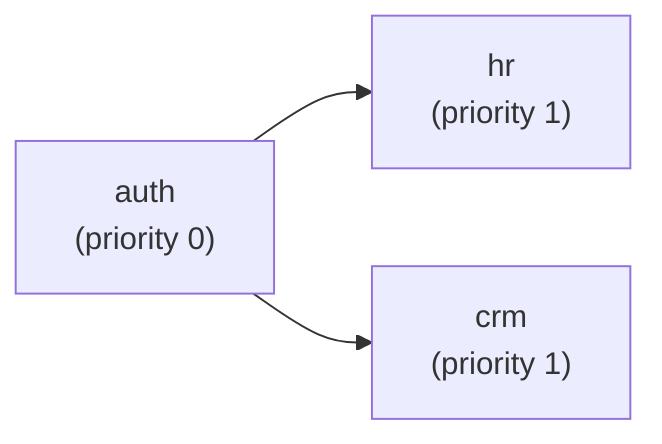

# Creating a Module

This guide walks you through creating a new EERP business module from scratch. We'll build a simple `hr` (Human Resources) module as a running example.

---

## Before You Start

A module is a Rust crate that compiles to WebAssembly. You need:

- Rust stable toolchain
- `wasm32-unknown-unknown` target: `rustup target add wasm32-unknown-unknown`
- A directory inside one of the paths listed in `module_root` in `eerp-config.json`

---

## Step 1: Create the Module Directory

```bash
mkdir -p modules/hr/src
```

---

## Step 2: Write module.json

```json
{
    "active": true,
    "name": "hr",
    "display_name": "Human Resources",
    "version": "0.1.0",
    "author": "Your Name",
    "description": "Employee and contract management",
    "depends": [],
    "priority": 0,
    "static_files": {},
    "is_service": true,
    "auto_install": true
}
```

**Checklist:**

- [ ] `name` is unique across all modules in `module_root`
- [ ] `depends` lists the `name` values of any modules that must load before this one
- [ ] `active: true` to enable on startup

---

## Step 3: Initialize the Rust Crate

```bash
cd modules/hr
cargo init --lib
```

Edit `Cargo.toml`:

```toml
[package]
name = "hr"
version = "0.1.0"
edition = "2021"

[lib]
crate-type = ["cdylib"]   # Required: produces a .wasm file

[profile.release]
opt-level = "s"           # Optimize for size
lto = true
```

---

## Step 4: Declare the Database Schema

Every module communicates its schema requirements via the migration protocol. Define the JSON as a static string:

```rust
// src/lib.rs

static MIGRATION: &str = r#"{
    "entity": "employees",
    "version": 1,
    "operations": [
        {
            "type": "add_column",
            "table": "employees",
            "column": "department",
            "sql_type": "VARCHAR(128)",
            "nullable": false
        },
        {
            "type": "add_column",
            "table": "employees",
            "column": "start_date",
            "sql_type": "DATE",
            "nullable": false
        },
        {
            "type": "add_column",
            "table": "employees",
            "column": "salary_cents",
            "sql_type": "BIGINT",
            "nullable": false
        },
        {
            "type": "add_column",
            "table": "employees",
            "column": "status",
            "sql_type": "VARCHAR(32)",
            "nullable": false
        }
    ]
}"#;

#[no_mangle]
pub extern "C" fn migrate() -> *const u8 {
    MIGRATION.as_ptr()
}

#[no_mangle]
pub extern "C" fn migrate_len() -> usize {
    MIGRATION.len()
}
```

!!! warning "Tables are not auto-created"
    The migration protocol currently only supports `add_column`. The base table (`employees`) must exist or be created via a future `create_table` operation. For now, the entity's base table is created by the Go-side repository when `MustRepo` is first called (this behaviour is under active development).

---

## Step 5: Implement Business Logic

Business logic runs in Go inside the module's service struct. Create the Go side of your module:

```
modules/hr/
├── module.json
├── Cargo.toml
├── src/
│   └── lib.rs           # Rust → WASM (schema + future handler calls)
└── internal/
    ├── employee.go      # Entity definition
    └── service.go       # Business logic
```

**`internal/employee.go`:**

```go
package hr

import (
    "eerp/core/orm/model"
    "time"
)

type Employee struct {
    model.BaseModel
    Department  string    `db:"department"`
    StartDate   time.Time `db:"start_date"`
    SalaryCents int64     `db:"salary_cents"`
    Status      string    `db:"status"` // "active", "on_leave", "terminated"
}

func (Employee) TableName() string { return "employees" }
```

**`internal/service.go`:**

```go
package hr

import (
    "context"
    "errors"
    "eerp/core/orm"
    "github.com/google/uuid"
)

var ErrEmployeeNotFound = errors.New("employee not found")

type Service struct {
    employees *orm.Repository[Employee]
    db        *orm.DB
}

func New(db *orm.DB) *Service {
    return &Service{
        employees: orm.MustRepo[Employee](db),
        db:        db,
    }
}

func (s *Service) Hire(ctx context.Context, e Employee) (Employee, error) {
    e.Status = "active"
    return s.employees.Create(ctx, e)
}

func (s *Service) Terminate(ctx context.Context, id uuid.UUID) (Employee, error) {
    var result Employee
    err := orm.Transact(ctx, s.db, func(tx *orm.Tx) error {
        txEmp := s.employees.WithTx(tx)
        emp, err := txEmp.FindByID(ctx, id)
        if errors.Is(err, orm.ErrNotFound) {
            return ErrEmployeeNotFound
        }
        if err != nil { return err }
        emp.Status = "terminated"
        result, err = txEmp.Update(ctx, emp, id)
        return err
    })
    return result, err
}

func (s *Service) ListByDepartment(ctx context.Context, dept string) ([]Employee, error) {
    return s.employees.Query().
        Where(orm.Cond("department = $1", dept)).
        Where(orm.Cond("status = $1", "active")).
        OrderBy("start_date ASC").
        All(ctx, s.db)
}
```

---

## Step 6: Compile the WASM Binary

```bash
cd modules/hr
cargo build --target wasm32-unknown-unknown --release
```

The output binary will be at:

```
target/wasm32-unknown-unknown/release/hr.wasm
```

Or use the top-level Makefile:

```bash
make build
```

---

## Step 7: Register with the Core

At startup, the module loader scans `module_root` and auto-discovers `hr.wasm` next to `module.json`. No explicit registration is needed.

To wire the Go service into the application, add to `cmd/app/main.go` (until a formal DI container exists):

```go
hrService := hr.New(db)
_ = hrService  // will be passed to HTTP handlers once the router is implemented
```

---

## Step 8: Verify Module Loading

Run the backend and look for the module loader's log output:

```bash
make run-back
```

Expected log output:

```
INFO  module detected  {"name": "hr", "version": "0.1.0", "priority": 0}
INFO  module migrated  {"name": "hr", "operations": 4}
INFO  module loaded    {"name": "hr"}
```

---

## Dependency Ordering

If your module depends on another (e.g., `hr` needs `auth` to be loaded first):

```json
{
    "name": "hr",
    "depends": ["auth"]
}
```

The detector will assign `hr` a higher priority than `auth`, ensuring `auth` loads and migrates first.



---

## Module Checklist

- [ ] `module.json` present with unique `name`
- [ ] Rust crate with `crate-type = ["cdylib"]`
- [ ] `migrate()` and `migrate_len()` exported from Rust
- [ ] Migration JSON is valid (operations reference correct table names)
- [ ] Go entity embeds `model.BaseModel`
- [ ] Go entity has `db` struct tags or snake_case field names
- [ ] `Service.New(db)` constructor wires repositories
- [ ] Module appears in startup logs without errors
