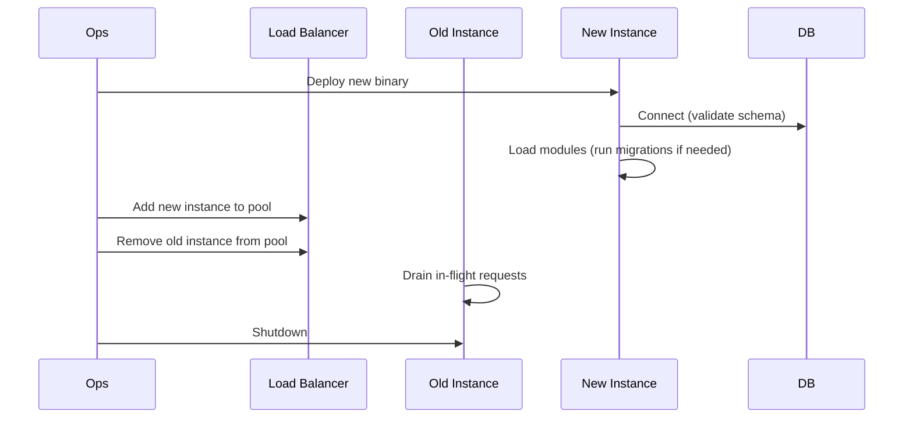

# Deployment

This page covers deploying EERP to a production environment.

---

## Overview

A production EERP deployment consists of three components:

| Component | Artifact | Typical host |
|---|---|---|
| Core backend | Go binary | VM, container, or bare metal |
| WASM modules | `.wasm` files + `module.json` | Same host as backend |
| Frontend | Static files (HTML/JS/CSS) | CDN or static host |
| Database | PostgreSQL 18 | Managed service or dedicated VM |

The frontend and backend are deployed independently. The frontend is a static SPA — no server required beyond a file server or CDN.

---

## Building the Backend

```bash
cd core
go build -o eerp-server ./cmd/app/...
```

For a minimal production binary with debug info stripped:

```bash
go build -ldflags="-s -w" -o eerp-server ./cmd/app/...
```

---

## Building WASM Modules

```bash
# From repo root
make build

# Or directly for a specific module
cd core/modules/crm
cargo build --target wasm32-unknown-unknown --release
```

The `.wasm` binaries need to be present in a directory listed in `module_root` in the config file, alongside their `module.json` files.

---

## Building the Frontend

```bash
cd core-front
npm install
npm run build
```

The built output is in `core-front/build/`. Serve this directory with any static file server or deploy to a CDN.

---

## Configuration

Create the config file in a secure location (e.g., `/etc/eerp/eerp-config.json`):

```json
{
    "module_root": ["/opt/eerp/modules"],
    "master_key": "GENERATE_WITH_openssl_rand_-hex_32",
    "db_name": "eerp_prod",
    "db_port": 5432,
    "db_host": "db.internal",
    "db_user": "eerp",
    "db_password": "STRONG_RANDOM_PASSWORD",
    "max_connection": 25,
    "min_connection": 5,
    "max_conn_idle_time": 1800,
    "max_conn_life_time": 3600,
    "health_check_period": 60,
    "connect_timeout": 10
}
```

File permissions:

```bash
chown eerp:eerp /etc/eerp/eerp-config.json
chmod 600 /etc/eerp/eerp-config.json
```

---

## Running the Server

```bash
/opt/eerp/eerp-server -config="/etc/eerp/eerp-config.json"
```

### systemd Unit

```ini
[Unit]
Description=EERP Application Server
After=network.target postgresql.service

[Service]
Type=simple
User=eerp
Group=eerp
WorkingDirectory=/opt/eerp
ExecStart=/opt/eerp/eerp-server -config=/etc/eerp/eerp-config.json
Restart=on-failure
RestartSec=5s
StandardOutput=journal
StandardError=journal

# Security hardening
NoNewPrivileges=yes
ProtectSystem=strict
ProtectHome=yes
ReadWritePaths=/opt/eerp/cache

[Install]
WantedBy=multi-user.target
```

```bash
systemctl enable --now eerp
```

---

## Docker

```dockerfile
# Build stage
FROM golang:1.26-alpine AS builder
WORKDIR /build
COPY core/ .
RUN go build -ldflags="-s -w" -o /eerp-server ./cmd/app/...

# Runtime stage
FROM alpine:3.20
RUN adduser -D eerp
COPY --from=builder /eerp-server /usr/local/bin/eerp-server
COPY modules/ /opt/eerp/modules/
USER eerp
EXPOSE 8080
ENTRYPOINT ["eerp-server"]
CMD ["-config=/config/eerp-config.json"]
```

Mount the config file as a volume or Kubernetes Secret:

```yaml
# docker-compose.prod.yml
services:
  eerp:
    image: eerp:latest
    ports:
      - "8080:8080"
    volumes:
      - ./config/eerp-config.json:/config/eerp-config.json:ro
      - ./modules:/opt/eerp/modules:ro
    depends_on:
      - db

  db:
    image: postgres:18
    environment:
      POSTGRES_DB: eerp_prod
      POSTGRES_USER: eerp
      POSTGRES_PASSWORD: "${DB_PASSWORD}"
    volumes:
      - pgdata:/var/lib/postgresql/data

volumes:
  pgdata:
```

---

## Database Setup

### Create the database and user

```sql
CREATE USER eerp WITH PASSWORD 'strong_password';
CREATE DATABASE eerp_prod OWNER eerp;
GRANT ALL PRIVILEGES ON DATABASE eerp_prod TO eerp;
```

### Connection pooling

For high-traffic deployments, place [PgBouncer](https://www.pgbouncer.org/) between EERP and PostgreSQL. Use transaction-mode pooling:

```ini
# pgbouncer.ini
[databases]
eerp_prod = host=db port=5432 dbname=eerp_prod

[pgbouncer]
pool_mode = transaction
max_client_conn = 1000
default_pool_size = 25
```

Adjust EERP's `max_connection` to match PgBouncer's `default_pool_size`.

---

## Health Checks

Once the HTTP server is running, use the health endpoints:

| Endpoint | Description |
|---|---|
| `GET /health` | Liveness: server is running |
| `GET /ready` | Readiness: DB connection is alive |

```bash
curl http://localhost:8080/health   # → 200 OK
curl http://localhost:8080/ready    # → 200 OK (or 503 if DB is down)
```

---

## Deploying a New Module

1. Compile the Rust crate:
   ```bash
   cargo build --target wasm32-unknown-unknown --release
   ```

2. Copy the `.wasm` binary and `module.json` to the `module_root` directory on the server.

3. Restart the EERP server:
   ```bash
   systemctl restart eerp
   ```

The module loader will detect the new module, run its migrations, and load it.

!!! note "Zero-downtime module deployment"
    Hot-loading of modules without restart is planned for a future version. Currently, a restart is required when adding or updating a module.

---

## Upgrading the Core



Because schema migrations are applied by the module loader (not by a separate migration tool), the new instance must be able to run migrations before receiving traffic. In blue/green deployments, bring the new instance up, let it migrate, then switch traffic.

---

## Observability

| Signal | Source | Destination |
|---|---|---|
| Application logs | `app.log` (JSON) | Log aggregator (Loki, Datadog, etc.) |
| Access logs | stdout (JSON) | Log aggregator |
| Metrics | Planned: `/metrics` (Prometheus format) | Prometheus + Grafana |
| Traces | Planned: OpenTelemetry | Tempo or Jaeger |

Structured logs are emitted as JSON in production mode (`Debug: false`). Forward `app.log` to your log aggregator using a sidecar or log shipper.

---

## Security Checklist

- [ ] `master_key` is a cryptographically random 32-byte hex string
- [ ] Config file is `0600`, owned by the process user
- [ ] Database password is strong and not the default
- [ ] TLS terminated at the load balancer or reverse proxy (nginx, Caddy)
- [ ] EERP backend not exposed directly to the internet
- [ ] PostgreSQL not exposed to the internet
- [ ] Module directory is read-only for the EERP process
- [ ] `active: false` for any modules not in use
