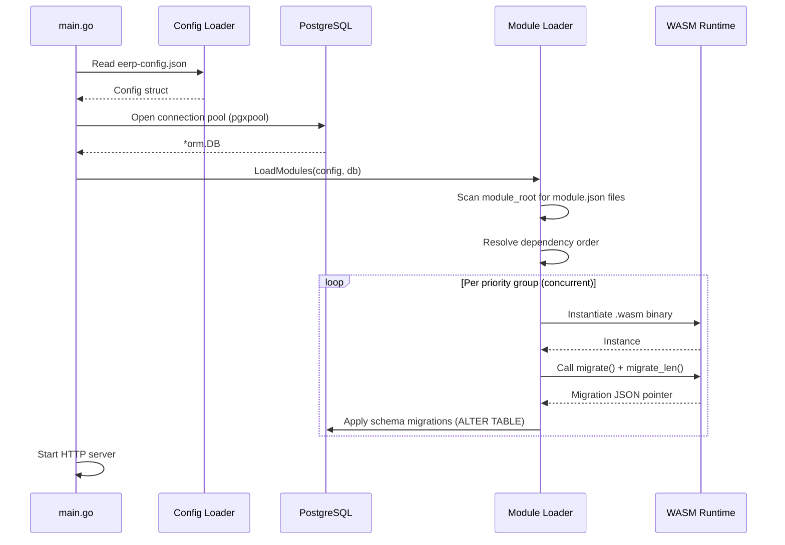

# Getting Started

This guide walks you through running EERP locally and making your first change.

---

## Prerequisites

| Tool | Minimum version | Purpose |
|---|---|---|
| Go | 1.26 | Backend runtime |
| Rust | stable + `wasm32-unknown-unknown` target | WASM module compilation |
| Docker / Docker Compose | v2 | PostgreSQL dev database |
| Node.js | 20+ | Frontend dev server |
| Make | any | Developer task runner |

Install the Rust WASM target once:

```bash
rustup target add wasm32-unknown-unknown
```

---

## Clone and Configure

```bash
git clone https://github.com/your-org/eerp.git
cd eerp
```

Copy and adjust the runtime configuration:

```bash
cp eerp-config.json.example eerp-config.json
```

The only fields you typically need to change locally are `module_root` (absolute path to where your compiled modules live) and `master_key` (used for signing tokens). See [Configuration](core/configuration.md) for a full reference.

---

## Start the Database

```bash
docker compose up -d
```

This starts PostgreSQL 18 on `localhost:5432` with:

- Database: `poc`
- User: `postgres`
- Password: `postgres`

---

## Run Everything

```bash
make run
```

This target starts three processes in sequence:

1. Database (Docker, if not already running)
2. Backend (`go run ./cmd/app/...`)
3. Frontend (`npm run dev` on `:5173`)

### Run only the backend

```bash
make run-back
```

### Run only the frontend

```bash
make run-front
```

---

## Build WASM Modules

WASM modules are Rust crates compiled to `wasm32-unknown-unknown`. To build all modules:

```bash
make build
```

The compiled `.wasm` binaries are placed into the module directories. The module loader auto-discovers them on startup.

---

## Project Startup Sequence

When you run the backend, the following happens in order:



---

## Running Tests

### Unit tests (no database required)

```bash
make run-back-tests BACKTESTPATH=./orm/...
```

### Integration tests (requires Docker database)

```bash
make run-back-tests BACKTESTPATH=./orm/pool/db/...
```

### Single test by name

```bash
make run-back-tests BACKTESTPATH=./orm/... ARGS="-run TestFindOne"
```

---

## Next Steps

- Read [Architecture Overview](architecture/index.md) to understand how the layers relate.
- Read [Creating a Module](developer-guide/creating-a-module.md) to build your first WASM module.
- Read [ORM](core/orm.md) to understand how to work with the database.
