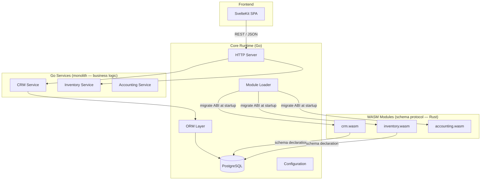

# EERP Developer Documentation

EERP is an open-source, modular ERP framework built around three principles: **type safety without runtime cost**, **modular extensibility via a hybrid WASM/Go model**, and **ERP-domain defaults baked into every layer**.

This documentation is written for developers joining the project. It explains not just what the code does, but _why_ it was built this way.

---

## What EERP is

EERP is a **framework**, not an application. Its job is to provide a runtime and a set of contracts against which independent ERP modules (inventory, CRM, accounting, HR, etc.) are developed and loaded.

EERP uses a **hybrid module model**:

- **WASM component** (Rust or any WASM-capable language): responsible only for declaring the module's database schema via the `migrate()` ABI. Runs inside a Wasmtime sandbox at startup.
- **Go service** (monolith): implements all business logic, directly compiled into the core binary. Uses the ORM and is wired into the HTTP server.

This split gives you schema isolation and sandboxing at startup, and maximum performance at request time.

> **Current state**: all shipped modules (CRM, etc.) run as pure Go services. The WASM migration protocol is implemented and active in the loader; Rust-compiled `.wasm` binaries are the next step for full schema decoupling.



---

## Stack at a Glance

| Layer | Technology | Why |
|---|---|---|
| Backend | Go 1.26 | Static binaries, excellent concurrency, strong type system |
| ORM | Custom (pgx v5) | Zero reflection at query time, ERP-specific features |
| Module schema | Rust → WASM (Wasmtime) | Sandboxed schema declaration, language-agnostic migrate() ABI |
| Module logic | Go (monolith) | Zero IPC overhead, full ORM access, single binary deploy |
| Database | PostgreSQL 18 | Mature, feature-rich, excellent Go driver ecosystem |
| Frontend | SvelteKit 5 + TypeScript | Minimal runtime, component-level reactivity, CSR-only |

---

## Documentation Map

| If you want to… | Start here |
|---|---|
| Run the project for the first time | [Getting Started](getting-started.md) |
| Understand how all the pieces fit | [Architecture Overview](architecture/index.md) |
| Work with the database | [ORM](core/orm.md) · [Database Layer](core/database.md) |
| Build a module (WASM/Rust path) | [Creating a WASM Module](developer-guide/creating-a-module.md) |
| Build a module (Go monolith path) | [Creating a Go Module](developer-guide/creating-a-go-module.md) |
| Add a new data entity | [Creating an Entity](developer-guide/creating-an-entity.md) |
| Write tests | [Testing](developer-guide/testing.md) |
| Understand a design decision | [ADRs](adrs/index.md) |

---

## Repository Layout

```
eerp/
├── core/                    # Go backend
│   ├── cmd/app/main.go      # Entry point — wires DB, WASM loader, Go services
│   ├── orm/                 # Custom ORM (public API)
│   ├── internal/
│   │   ├── module/          # Hybrid module loader (WASM migrate ABI + Go service init)
│   │   │   ├── detector.go  # Filesystem scan, dependency resolution, priority assignment
│   │   │   ├── load.go      # Wasmtime instantiation, migrate() call, DDL application
│   │   │   ├── migration.go # applyMigration — executes ALTER TABLE via pgx
│   │   │   └── snapshot.go  # Change detection cache
│   │   ├── types/           # Shared types (Config, Module, Migration, Operation)
│   │   └── common/          # Logger, file utilities, dependency resolver
│   └── modules/
│       └── crm/             # CRM module — Go service (monolith business logic)
│           └── internal/
│               └── crm.go   # Contact entity + Service (Create/List/Update/Delete)
├── core-front/              # SvelteKit frontend
│   └── src/routes/          # Page routes
├── compose.yml              # PostgreSQL dev environment
├── eerp-config.json         # Runtime configuration (module_root, DB, pool)
└── Makefile                 # Developer commands
```
