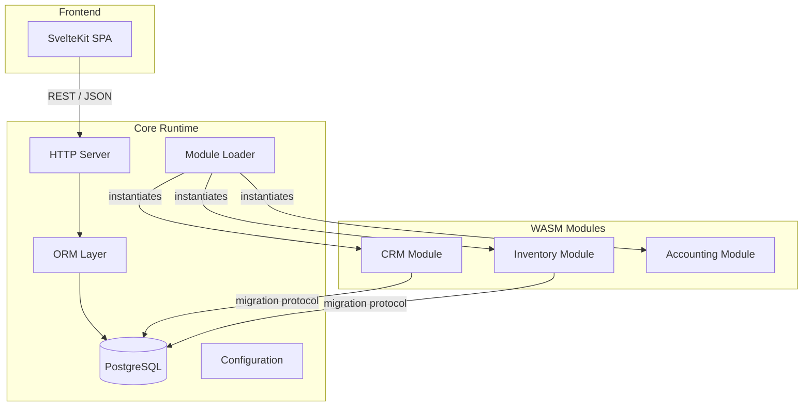

# EERP Developer Documentation

EERP is an open-source, modular ERP framework built around three principles: **type safety without runtime cost**, **modular extensibility via WebAssembly**, and **ERP-domain defaults baked into every layer**.

This documentation is written for developers joining the project. It explains not just what the code does, but _why_ it was built this way.

---

## What EERP is

EERP is a **framework**, not an application. Its job is to provide a runtime and a set of contracts against which independent ERP modules (inventory, CRM, accounting, HR, etc.) are developed and loaded. The core never changes when you add a business feature; you ship a new WASM module.



---

## Stack at a Glance

| Layer | Technology | Why |
|---|---|---|
| Backend | Go 1.26 | Static binaries, excellent concurrency, strong type system |
| ORM | Custom (pgx v5) | Zero reflection at query time, ERP-specific features |
| Modules | Rust → WASM | Language-agnostic, sandboxed, independent deployability |
| Database | PostgreSQL 18 | Mature, feature-rich, excellent Go driver ecosystem |
| Frontend | SvelteKit 5 + TypeScript | Minimal runtime, component-level reactivity, CSR-only |

---

## Documentation Map

| If you want to… | Start here |
|---|---|
| Run the project for the first time | [Getting Started](getting-started.md) |
| Understand how all the pieces fit | [Architecture Overview](architecture/index.md) |
| Work with the database | [ORM](core/orm.md) · [Database Layer](core/database.md) |
| Build a new business module | [Creating a Module](developer-guide/creating-a-module.md) |
| Add a new data entity | [Creating an Entity](developer-guide/creating-an-entity.md) |
| Write tests | [Testing](developer-guide/testing.md) |
| Understand a design decision | [ADRs](adrs/index.md) |

---

## Repository Layout

```
eerp/
├── core/                    # Go backend
│   ├── cmd/app/main.go      # Entry point
│   ├── orm/                 # Custom ORM (public API)
│   ├── internal/
│   │   ├── module/          # WASM module loader
│   │   ├── types/           # Shared types (Config, Module, Migration)
│   │   └── common/          # Logger, file utilities, dependency resolver
│   └── modules/
│       └── crm/             # Reference module implementation (Rust)
├── core-front/              # SvelteKit frontend
│   └── src/routes/          # Page routes
├── compose.yml              # PostgreSQL dev environment
├── eerp-config.json         # Runtime configuration
└── Makefile                 # Developer commands
```
